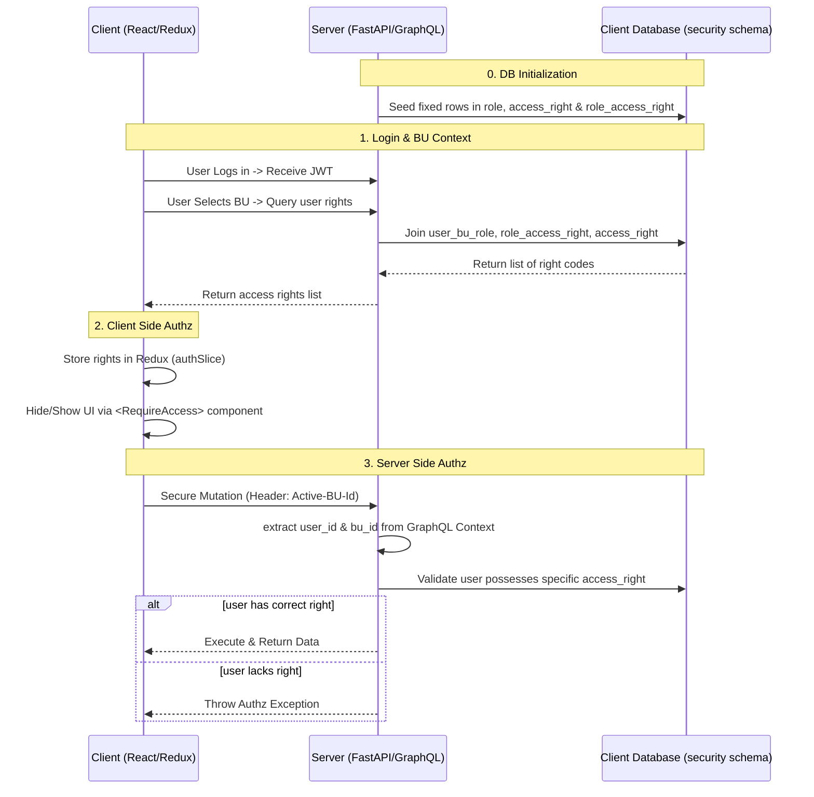

# Plan: Simple and Fixed Role-Based Access Management

## Objective

Implement a robust, fixed Role-Based Access Control (RBAC) system for both the server (FastAPI/GraphQL) and the client (React/Redux). This implementation will rely entirely on the existing DB schema (`security.role`, `security.access_right`, `security.role_access_right`, `security.user_bu_role` and `security.user`).

The "fixed" nature means roles and access rights are predefined in code and seeded into the database, simplifying management while retaining flexibility per Business Unit (BU).

---

## Workflow

---

## Steps

### Step 1: Define Constants & Seed Database (Server)

- **Action**: Create a centralized configuration file (e.g., `app/core/rbac_constants.py`) specifying the fixed Roles (e.g., `ADMIN`, `MANAGER`, `VIEWER`) and Access Rights (e.g., `USER_CREATE`, `BU_UPDATE`, `REPORT_VIEW`).
- **Action**: Develop a database seeding utility. When a new client database is created, insert these predefined roles into `security.role`, rights into `security.access_right`, and link them in `security.role_access_right`. Avoid duplication by using `ON CONFLICT DO NOTHING`.

### Step 2: Establish Context & Authentication Tokens (Server)

- **Action**: Ensure the JWT token strictly provides the `user_id`.
- **Action**: Update the GraphQL application context builder to parse an incoming HTTP Header (e.g., `x-active-bu-id`) that the client will send on every request to identify the context in which the user is operating.

### Step 3: Implement Server-Side Authorization Helper (Server)

- **Action**: Create a resolver helper function, e.g., `require_access(context, right_code: str)`.
- **Details**:
  1. Extract `user_id` and `active_bu_id` from `context`.
  2. Handle Admin/Super Admin globally if `is_admin` is true in the user table, granting bypass if applicable.
  3. Query the client database against `security.user_bu_role` joining `security.role_access_right` and `security.access_right` using the provided `bu_id`.
  4. Validate if the `user_id` is linked to `<right_code>` and that `user_bu_role.is_active` is `True`.
  5. Block the request and raise a GraphQL validation/auth exception if unauthorized.

### Step 4: Implement Access Rights Synchronization (Server & Client)

- **Action**: Create a GraphQL query `getMyAccessRights(buId: Int!)` which returns an array of strings representing the right codes the current user has within the given BU.
- **Action**: React application executes `getMyAccessRights` upon initial application load and immediately after switching between different Business Units (BUs).

### Step 5: Global State Management (Client)

- **Action**: Add a new state segment inside the Redux `authSlice` to hold the current `accessRights: string[]` mapped to the currently selected `buId`.
- **Action**: Empty this array upon application logout or when deselecting the active BU to prevent privilege bleed.

### Step 6: Client-Side UI Control and Hooks (Client)

- **Action**: Develop a specialized hook `useAccessRight(rightCode: string) => boolean` leveraging the Redux `useAppSelector` to verify if the right currently resides in state.
- **Action**: Build a flexible wrapper component `<RequireAccess right="CODE"> {children} </RequireAccess>`. If the condition evaluates to true, render `{children}`, else render a fallback or `null`.
- **Action**: Apply `<RequireAccess>` logic to dynamically hide navigation menu links, disable specific buttons on data tables, and restrict React Router paths inside component loaders or route guards.
