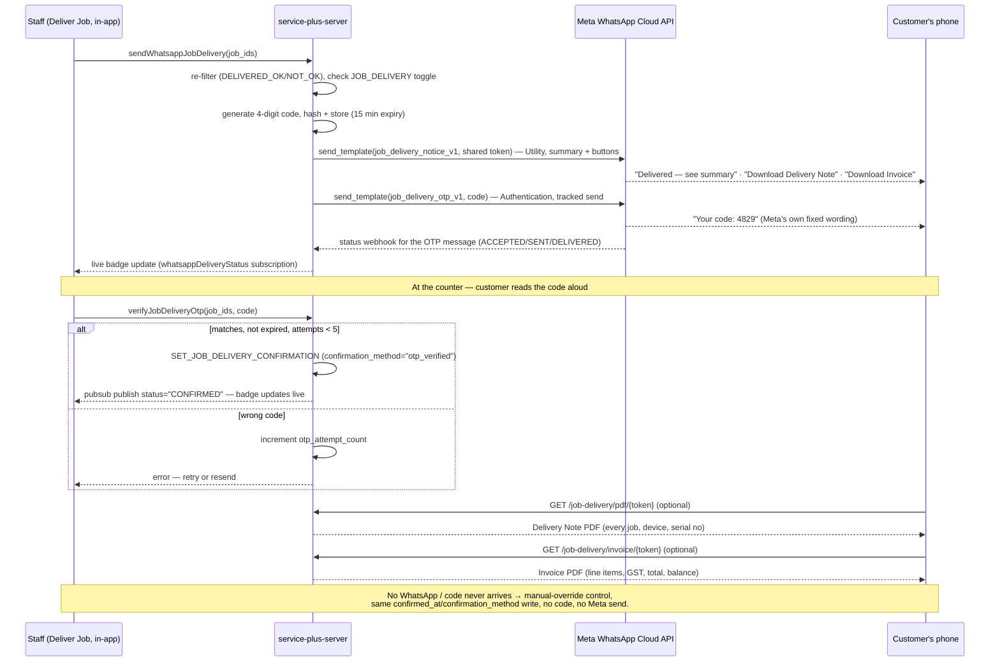

# Paperless Job Delivery via WhatsApp — Design (not implemented yet)

## Goal

Replace the printed **Delivery Note** and the printed **Invoice + Receipt**
with a WhatsApp message carrying a one-time confirmation code and two
on-demand PDFs — a **Delivery Note** (itemized list of every job delivered,
with device and serial number per job) and an **Invoice** (the formal
line-item bill, GST/tax breakdown included) — both served entirely by
`service-plus-server`. No dependency on `service-plus-web`. Third leg of the
existing WhatsApp rail — `JOB_CREATION` and `JOB_COMPLETION` already ship on
it; `JOB_DELIVERY` reuses the same send/track mechanism for a third event.

**One delivery is not one intake batch.** A single "Deliver Selected" action
can include jobs from several different intake `batch_no`s, plus individually
(non-batch) created jobs, all for one customer — delivery grouping is
independent of intake grouping. Nothing in this design may assume a delivery
shares one `batch_no`, the way an intake batch legitimately does.

## What already exists

```
server  app/whatsapp/{client.py, sender.py, templates.py, mobile.py, token.py}
            client.py    send_template() — text + URL buttons, no media/document
                         upload (client.py:62,78,98)
            sender.py    _EVENT_CODE_BY_KEY = {"JOB_COMPLETION":"CC","JOB_CREATION":"JC"}
                         (line 97); _is_event_enabled() (line 100) — per-BU
                         on/off gate from app_setting.whatsapp_notifications,
                         already has an unused JOB_DELIVERY slot
            token.py     sign()/verify() — HMAC-signed link token, reused
                         here only for the Delivery Note PDF link, unchanged
        app/routers/public/job_intake_router.py
            GET /job-intake/{token}, GET /job-intake/pdf/{token} — the
            pattern this design's PDF route copies
        app/routers/webhooks/whatsapp_webhook_router.py
            _EVENT_KEY_BY_CODE = {"CC":"JOB_COMPLETION","JC":"JOB_CREATION"} (line 103)
        app/db/sql/sql_jobs.py
            GET_JOBS_FOR_WHATSAPP_COMPLETION/_CREATION, SET_JOB_WHATSAPP_ATTEMPT/_OUTCOME
            (already event_key-parameterized)
        app/db/sql/sql_public.py    PublicSql.GET_JOB_INTAKE_STATUS (token-gated read)
        app/graphql/resolvers/mutation.py
            sendWhatsappCompletion (421) / sendWhatsappJobIntake (434) — no
            dedicated access-right guard; gated by the calling screen
        app/graphql/schema.graphql   lines 45-46 (Generic scalar)
        app/core/settings/whatsapp_settings.py
            whatsapp_link_token_secret (line 42) — dedicated secret per trust
            boundary; this design adds a sibling secret on the same principle
client  jobs/send-whatsapp-job-intake.ts        {results, disabled} wrapper pattern
        jobs/use-send-whatsapp-job-intake.tsx   confirms before sending (Yes/No,
                                                 default No) — same UX to reuse
        jobs/whatsapp-status-cell.tsx           generalized on an `eventKey` prop
        jobs/deliver-job/deliverable-jobs-grid.tsx
                                                 multi-select grid, "Deliver Selected (N)"
                                                 button, source query filtered on
                                                 is_final=true AND is_closed=false —
                                                 multi-job delivery is the normal path
                                                 here, not an edge case
        jobs/deliver-job/delivery-modal.tsx     isDelivered (line 328): job_status_code
                                                 ∈ {DELIVERED_OK, DELIVERED_NOT_OK};
                                                 isSingleJob (330); branchId in scope
                                                 (505, 792); "Delivery Note" button
                                                 disabled state at line 1134
        jobs/batch-warranty-transactions/*      "Jobs → Batch Warranty Jobs" — a
                                                 SEPARATE screen (own access right,
                                                 JOBS_BATCH_WARRANTY_TRANSACTIONS) that
                                                 cascades several existing warranty jobs
                                                 for one customer through Completed OK →
                                                 Final → Deliver together, with its own
                                                 "Job Delivery Note" button on the results
                                                 screen (process-jobs-modal.tsx) — a second
                                                 UI entry point that produces delivered
                                                 jobs, distinct from delivery-modal.tsx
        jobs/deliver-job/fetch-delivery-note-jobs.ts
                                                 fetchDeliveryNoteJobsByIds — shared by
                                                 both entry points above, confirming both
                                                 ultimately just mark job rows
                                                 DELIVERED_OK/NOT_OK the same way
        jobs/deliver-job/deliver-job-pdf.ts      buildDeliveryNotePdf (line 980) — the
                                                 EXISTING paper Delivery Note. Its
                                                 multi-job table (line 919-922) has no
                                                 dedicated Serial No column; serial_no is
                                                 buried, unlabeled, inside a concatenated
                                                 "Device / Service" string
                                                 (GET_DELIVERABLE_JOBS_DETAIL_MULTI,
                                                 sql_jobs.py:1799), and remarks are one
                                                 shared block for the whole batch, not
                                                 per-job. This design's new Delivery Note
                                                 PDF must not repeat that gap (see Step 1).
```

## What "paperless job delivery" means here

1. **Two** WhatsApp messages sent once job(s) reach `DELIVERED_OK`/`DELIVERED_NOT_OK`
   (not one — see "Two Meta templates for one logical event" in Step 3): a
   Utility message with the job-list summary, amount paid/balance, and two
   buttons — **"Download Delivery Note"** and **"Download Invoice"** — followed
   by a separate Authentication message carrying only the 4-digit confirmation
   code, in Meta's own fixed wording.
2. Customer reads the code to staff at the counter; staff enter it in-app;
   server verifies and records confirmation. No customer-facing web page.
3. **"Download Delivery Note"** serves a server-built PDF (reportlab,
   token-gated, same mechanism as `/job-intake/pdf/{token}`) — one row per
   delivered job with its own device and **serial number**, regardless of
   which intake batch (or none) each job originally came from.
4. **"Download Invoice"** serves a second server-built PDF, the formal
   line-item bill — parts and service charges with GST rate/HSN each,
   subtotal, tax, total, amount paid, balance due — mirroring what the
   existing jsPDF Invoice+Receipt shows today, reimplemented in reportlab
   from whitelisted public fields, not a port of the client-side builder.
   Both PDFs share the same token; neither is ever a WhatsApp document
   attachment.

Existing print buttons in `delivery-modal.tsx` are unchanged — this is an
additional path, not a replacement. Money Receipts are unchanged and out of
scope; payment is assumed already settled by the time this is clicked.

## Design decisions

| Question | Decision |
|---|---|
| What gets sent | Job-list summary + amount paid/balance + a 4-digit numeric code + two buttons, "Download Delivery Note" and "Download Invoice". Neither PDF is attached to the message itself. |
| Channel | **Two** templates, one send each: `job_delivery_notice_v1` (Utility — summary text + **two** URL buttons, same button-count shape as `job_intake_notice_v2`) and `job_delivery_otp_v1` (Authentication — the code alone, Meta's fixed wording). Split because Meta's classifier rejects a numeric "confirmation code" variable inside a Utility template regardless of surrounding content (confirmed directly in Meta's editor, 2026-09-02). |
| Trigger | New "Whatsapp Delivery (Paperless)" button in Deliver Job's footer, `disabled={!isDelivered}`, next to "Delivery Note" — additive. |
| Message wording, multi-job | No `_build_reference_line`/`batch_no` reuse — that helper assumes one shared `batch_no` for the group, true for intake (one drop-off, one batch) but false for delivery (jobs from several intake batches, or unbatched individual jobs, can be delivered together). Delivery gets its own reference-line builder that lists `job_no`s directly (reusing `_format_job_no`'s 3-then-elide truncation), never a "Batch No: N" framing. |
| Proof of delivery | One-time code, delivered only in the WhatsApp body (never a link), read by the customer to staff, entered by staff in-app. Ties confirmation to physical presence and a staff witness — stronger than a tap-link, but still not identity verification (anyone holding the customer's phone can read it out). |
| Where verification happens | Inside the authenticated app, by staff. Not a public route — no customer-facing confirmation page exists in this design. |
| Code lifetime | 4 digits, cryptographically random, 15-minute expiry, max 5 attempts before a resend is required. 10,000 possible codes, not 1,000,000 — same order of magnitude as a bank ATM PIN, and just as reliant on the attempt lockout (not the keyspace) for real security; see Watch-outs. |
| Code storage | Hashed (HMAC-SHA256, new dedicated secret `whatsapp_delivery_otp_secret`) — never plaintext at rest, never logged, never returned to the client. |
| `token.py` | Unchanged; one token, reused for both the Delivery Note and Invoice PDF links (same "one token, no new parameter" trick `JOB_CREATION`'s two buttons already use). |
| Confirmation record | New key `JOB_DELIVERY` in the existing `job.whatsapp_notifications` jsonb — no new columns/tables. Also records `confirmed_by_staff_id` (which staff member verified/overrode) — accountability, not a secret, so no risk in retaining it. |
| Per-event toggle | Already exists (`app_setting.whatsapp_notifications`, `JOB_DELIVERY` slot, currently `false`) — this design's send path must call the existing `_is_event_enabled(..., "JOB_DELIVERY")`. |
| Staff override | Checkbox/button — "Customer confirmed in person / no WhatsApp" — writes `confirmation_method='manual_override'` directly, no code, always available. |
| Resend | Re-running the send mutation mints a fresh code and invalidates the old one — no separate resend mutation. |
| Meta button URL | Registered with **no placeholder text** — bare prefix, "Dynamic URL" type. Meta appends the sent value to the registered string; it does not substitute placeholders in-place (`job_intake_notice_v1`/its successor both shipped broken this way — see `plans/plan-whatsapp.md`'s Meta-template section). Get this right on first submission; an approved template can't be edited. |
| Public host for the button | Not stored anywhere — no app-setting. Baked directly into the Meta-registered template, same as `JOB_CREATION`'s working template. (An earlier `job_intake_url` setting existed for this and was deleted — it was never actually read by any code.) |
| Gates `is_closed`? | No. Accounts posting/stock fire exactly as today; confirmation is informational only. |
| Payment via WhatsApp | Out of scope — no payment gateway exists in this codebase. |
| Multi-job / batch delivery | The normal case, not an edge case — `deliverable-jobs-grid.tsx` already lets staff multi-select. One send, one shared OTP, written identically to every `job_id` in it. The send mutation returns the exact `job_ids` it actually covers (see Step 3) so the client never assumes a set the server silently narrowed. |
| RETURN-status jobs | Covered automatically, no special-casing — `RETURN` (`is_final=true`) reaches `DELIVERED_OK`/`DELIVERED_NOT_OK` through the same Deliver Job path as a completed repair (`GET_DELIVERABLE_JOBS_PAGED` filters only on `is_final`/`is_closed`, not status code). An unrepaired return with no charge is already handled by `amount_line`'s existing "No charge" fallback. |
| Second entry point | "Jobs → Batch Warranty Jobs" can also produce delivered jobs (cascading Completed OK → Final → Deliver for several existing warranty jobs at once), separate from `delivery-modal.tsx`. The send trigger must be wired into both screens (Step 4) — the server side needs no changes, since it re-filters by status, not by which screen triggered delivery. |

## Data model

`whatsapp_notifications` gains a third key:

```jsonc
{ "JOB_DELIVERY": { "attempt_count", "success_count", "fail_count",
                     "last_wamid", "last_status", "last_sent_at", "last_error",
                     "otp_hash": null,           // HMAC-SHA256(code)
                     "otp_expires_at": null,
                     "otp_attempt_count": 0,     // lockout at 5
                     "confirmed_at": null,
                     "confirmation_method": null,  // "otp_verified" | "manual_override"
                     "confirmed_by_staff_id": null  // logged-in staff user id who verified/overrode
} }
```

`confirmed_by_staff_id` names the specific staff member who performed the
verification (or manual override) — a materially better dispute-defense
record than storing the OTP itself would be ("verified by this named
employee" beats "a correct-looking code was entered somewhere"), with no
security downside since it's not a secret. Populated from the caller's
existing authenticated session, the same identity already available to every
other staff-facing mutation in this codebase — no new auth plumbing.

Attempt/outcome fields need zero SQL changes (`SET_JOB_WHATSAPP_ATTEMPT`/
`_OUTCOME` already take `%(event_key)s`). OTP and confirmation fields are new,
written by dedicated queries (Step 1) — not through `SET_JOB_WHATSAPP_OUTCOME`,
whose `WHERE` clause requires a Meta `wamid`/status-ladder match that an OTP
verification has neither.

A batch writes the same `otp_hash`/`otp_expires_at` onto every `job_id` in
the send, in one transaction (mirrors how attempt/outcome fields are already
written per-job for a group send) — a partial write must never leave some
jobs in a batch with a stale/missing hash while others have the new one.
`verifyJobDeliveryOtp` checks that **every** `job_id` passed shares the same
matching hash before confirming any of them — it does not trust one
representative job on the assumption the rest match. `otp_attempt_count` is
incremented on every job in the batch together on a wrong guess, so the
5-attempt lockout can't drift out of sync across jobs in the same batch.

A send exceeding `MAX_JOBS_PER_WHATSAPP_MESSAGE` (35) splits into multiple
messages, each with its **own** code — documented as a known limitation
(Watch-outs), not specially handled in the UI; a delivery that large is
expected to be rare enough to use manual-override instead.

## Workflow



## Implementation Steps

Four steps, each independently buildable/testable. Step 1 → Step 2 → Step 3 →
Step 4 (Step 2's proxy config needs Step 1's routes to exist to be worth
verifying; Step 3's button URLs need Step 2 live before a real send is
meaningful to test; Step 4 needs Step 3's mutations to exist) — same
one-step-at-a-time cadence `plan-whatsapp.md` used.

### Step 1 — Server foundation: event key, OTP storage/verification, Delivery Note PDF route — ✅ Done

Implemented and verified: both PDF builders tested locally against sample
data (single job, a delivery spanning two different intake batches plus an
individually-created job, a zero-charge RETURN job, and a multi-job invoice
including a job with no invoice row yet) — all five render cleanly. Two real
bugs caught and fixed during that verification: reportlab's core Helvetica
font has no glyph for `₹` (renders as a solid black box) — switched to
`"Rs. "`; the Serial No/Batch columns wrapped mid-word at their original
widths — widened and tightened padding, mirroring the fix already applied to
the job-intake PDF's own "#" column earlier. `GET_JOB_DELIVERY_INVOICE_DETAIL`
is grounded in the real `job_invoice`/`job_invoice_line` schema, not the
speculative "TBD" placeholder this step originally shipped with.

- `app/whatsapp/sender.py` — add `"JOB_DELIVERY": "JD"` to `_EVENT_CODE_BY_KEY` (line 97).
- `app/routers/webhooks/whatsapp_webhook_router.py` — add `"JD": "JOB_DELIVERY"` to `_EVENT_KEY_BY_CODE` (line 103).
- `app/core/settings/whatsapp_settings.py` — new `whatsapp_delivery_otp_secret` field (same shape as `whatsapp_link_token_secret`); add to `.env.example`.
- `app/whatsapp/otp.py` (new) — `generate()` (4-digit, `secrets` module), `hash_code()` (HMAC-SHA256), `verify()` (constant-time compare). Separate from `token.py` — short-lived/attempt-limited, not a self-contained signed link.
- `app/db/sql/sql_jobs.py`:
  - `GET_JOBS_FOR_WHATSAPP_DELIVERY` — modeled on `GET_JOBS_FOR_WHATSAPP_COMPLETION`/`_CREATION`, filtered `js.code IN ('DELIVERED_OK','DELIVERED_NOT_OK') AND j.branch_id = %(branch_id)s` (mirrors `isDelivered`, line 328) — **`branch_id` is a required argument, cross-checked against `job_ids` the same way both existing WhatsApp source queries already do**; never trust `job_ids` alone to imply the caller is authorized for those jobs' branch. Include a paid-amount subquery for balance.
  - `SET_JOB_DELIVERY_OTP` — writes `otp_hash`/`otp_expires_at`, resets `otp_attempt_count`, per job in the send.
  - `GET_JOB_DELIVERY_OTP` — reads the three OTP fields for Python-side comparison.
  - `INCREMENT_JOB_DELIVERY_OTP_ATTEMPT` — `otp_attempt_count += 1`.
  - `SET_JOB_DELIVERY_CONFIRMATION` — takes `confirmation_method` **and `staff_id`**; writes `confirmed_at`/`confirmation_method`/`confirmed_by_staff_id`, no ladder/wamid check.
  - `GET_JOB_DELIVERY_OTP_PENDING` (new, feeds Step 4's "Verify Code" affordance) — per job, a single boolean: `otp_hash IS NOT NULL AND otp_expires_at > now() AND confirmed_at IS NULL`. Lets the client know a still-valid code is waiting without exposing the hash or expiry timestamp itself.
- `app/db/sql/sql_public.py`:
  - `PublicSql.GET_JOB_DELIVERY_STATUS`, modeled on `GET_JOB_INTAKE_STATUS` but **per-job, not per-batch**: `job_no`, **`batch_no` as each row's own value** (the intake batch that job came from, if any — never treated as one shared value for the whole delivery, unlike `GET_JOB_INTAKE_STATUS`'s use of it), `device`, **`serial_no` as its own column** (not concatenated into `device`), `branch_name`, `customer_name`, `amount` + paid-amount subquery. Not filtered by `is_closed`. Feeds the Delivery Note PDF.
  - `PublicSql.GET_JOB_DELIVERY_INVOICE_DETAIL` (new, for the Invoice PDF) — **resolved against the real schema**, not the "TBD" this step was originally drafted with: `job_invoice` (header — invoice_no, invoice_date, cgst/sgst/igst_amount, amount, is_posted) LEFT JOINed to `job_invoice_line` (description, part_code, hsn_code, qty, price, gst_rate, amount) via `job_invoice_id`, one denormalized row per line item, header fields repeated per line — same shape as this codebase's other multi-row job-detail queries. LEFT JOIN throughout, not JOIN: a job with no invoice yet (e.g. a zero-charge RETURN) still gets a row, with null invoice/line fields, rather than silently vanishing from the PDF.
- `app/routers/public/job_delivery_router.py` (new, PDF-only — no HTML confirmation page):
  ```
  GET /job-delivery/pdf/{token}          → application/pdf (Delivery Note)
  GET /job-delivery/invoice/{token}      → application/pdf (Invoice)
  ```
  Same construction/rate-limiting style as `job_intake_router.py`'s PDF route. The Delivery Note renders one row per delivered job — job no, device, **serial no**, and (informational only) which intake batch it came from, if any — regardless of how many distinct intake batches or individually-created jobs are mixed into this one delivery; deliberately not repeating the existing paper Delivery Note's gap (serial number unlabeled and buried inside a concatenated "Device / Service" string, one shared remarks block for the whole group instead of per-job). The Invoice renders the formal line-item bill from `GET_JOB_DELIVERY_INVOICE_DETAIL`. Both PDFs stand on their own without the customer needing the paper originals. Register in `app/main.py`.
- Manual-override: new `setJobDeliveryManualConfirmation` mutation → `SET_JOB_DELIVERY_CONFIRMATION` with `confirmation_method='manual_override'` and the calling staff member's id (from the existing authenticated session — same identity source every other staff-facing mutation already has), same `pubsub.publish(..., status="CONFIRMED")`.

**Test alone**: hash a test code, verify right/wrong codes, confirm lockout/expiry behavior; hand-sign a `token.py` token and confirm both `GET /job-delivery/pdf/{token}` and `GET /job-delivery/invoice/{token}` download (locally — the nginx step below is what makes these reachable in production). No Meta or client UI needed.

### Step 2 — nginx reverse proxy (production) — ✅ Done

The `location /job-delivery/` block has been applied manually on the
production server, ahead of Steps 1/3/4 — the config exists before the
FastAPI routes it proxies to do. Until Step 1 ships, a request here reaches
nginx correctly but gets a plain FastAPI 404 (no route registered yet), not
the SPA's static-file fallback that showed up before this was applied.

Without this, both PDF routes 404 once deployed: the SPA's catch-all
`try_files` intercepts any path with no matching `location` block before it
ever reaches FastAPI — exactly the bug hit and fixed for `/job-intake/`
during `JOB_CREATION`'s rollout (`notes/Deployment.md`). Same fix, same file,
same shape:

1. Edit `notes/Deployment.md`'s documented nginx config first — add the new
   block immediately after the existing `location /job-intake/` block, so
   the doc and the live server never drift apart:
   ```
   location /job-delivery/ {
       proxy_pass http://127.0.0.1:8000/job-delivery/;
       proxy_set_header Host $host;
       proxy_set_header X-Real-IP $remote_addr;
       proxy_set_header X-Forwarded-For $proxy_add_x_forwarded_for;
       proxy_set_header X-Forwarded-Proto $scheme;
   }
   ```
2. Apply the identical block to the live file,
   `/etc/nginx/conf.d/service-plus-server.conf` (per `notes/Deployment.md`'s
   own setup steps).
3. `sudo nginx -t` — validate syntax **before** touching the running server;
   a typo here should fail loudly here, not by taking `/api/`/`/graphql/`
   down with it.
4. `sudo nginx -t && sudo systemctl reload nginx` — reload, not restart, so
   in-flight connections (including any open GraphQL subscription sockets)
   aren't dropped. Same one-liner `notes/Deployment.md` already documents
   for this exact operation.
5. Verify from outside the server: `curl -sI https://<prod-host>/job-delivery/pdf/anything`
   should show FastAPI/uvicorn response headers, not openresty's static-file
   headers (`etag`, `last-modified`, `accept-ranges`) — the same diagnostic
   that caught the original `/job-intake/` gap.

**Dependencies**: Step 1's routes need to exist in `job_delivery_router.py`
(even returning a placeholder) for step 5's `curl` check to be meaningful —
otherwise identical to how `/job-intake/`'s own nginx fix was applied.

**Test alone**: the `curl` check above, run against a real deployment. No
Meta, no client UI, no database state needed — this step is pure
infrastructure and can be verified in complete isolation from the rest of
the feature.

### Step 3 — Meta templates and the WhatsApp send + verify path — ✅ Done

Implemented and verified. `templates.py`/`client.py`'s two-template split
(Utility summary + Authentication OTP) was already done in an earlier pass;
this pass added `sender.py`'s orchestration (`_build_delivery_reference_line`,
`_build_amount_line`, `_build_delivery_params`, `_send_delivery_chunk`,
`send_job_delivery_notice`, `verify_job_delivery_otp`,
`get_job_delivery_otp_pending`), and wired `sendWhatsappJobDelivery`/
`verifyJobDeliveryOtp` into `mutation.py` and `getJobDeliveryOtpPending` into
`query.py` (as `type Query`, not `type Mutation` — this step's text originally
said to add all three "next to `sendWhatsappJobIntake`," which is only correct
for the two mutations; `getJobDeliveryOtpPending` is a pure read and belongs
under `schema.graphql`'s `type Query` block instead, alongside `genericQuery`).
Verified without a live DB or Meta credentials, using mocked
`exec_sql`/`exec_sql_query`/`exec_sql_batch`/`send_template`/`pubsub.publish`:
the full `sendWhatsappJobDelivery` orchestration (customer grouping, invalid-
mobile skip, two ordered template sends per chunk, one-transaction
`SET_JOB_DELIVERY_OTP` write via `exec_sql_batch` with an identical hash/expiry
across every job_id in the chunk, only the OTP send's `wamid` persisted to
`whatsapp_notifications`); all six `verifyJobDeliveryOtp` outcomes
(`NO_PENDING_OTP`, `JOB_SET_MISMATCH`, `EXPIRED`, `TOO_MANY_ATTEMPTS`,
`INCORRECT_CODE`, `CONFIRMED`); both `getJobDeliveryOtpPending` states; and the
full Ariadne schema (`schema.graphql` + every resolver module) building
without error. The `copy_code` button payload shape remains unconfirmed by a
real send, as already flagged in `client.py`.

**Two Meta templates for one logical event, not one** — confirmed directly in
Meta's template editor (2026-09-02): a body containing a numeric
"confirmation code" variable gets flagged "Category does not match... This
message template will be rejected" if submitted as Utility, regardless of
what else is in the message. There's no fighting this — Authentication
templates are also structurally different (no header, Meta-owned fixed body
wording, positional-only parameters), not just a different category label on
the same shape. So `send_job_delivery_notice` sends **two** WhatsApp messages
per customer, back to back: the delivery summary (Utility, content we
control) and the confirmation code (Authentication, Meta's fixed wording).

- `app/whatsapp/templates.py`:
  - `TEMPLATES["JOB_DELIVERY"]` — **registered Meta template name:
    `job_delivery_notice_v1`** (Utility category, language `en`),
    `button_count=2`. No OTP anywhere in this template — that's the whole
    point of the split:
    ```
    Header: Service update from {{business_unit}} team
    Body: Hi {{customer_name}},
          Your {{reference_line}} has been delivered.
          {{amount_line}}
          Branch: {{branch_name}}  Contact: {{branch_contact}}.
          Thank you for choosing us.
    Button 1: "Download Delivery Note" — Dynamic URL, bare prefix https://serviceplus.cloudjiffy.net/job-delivery/pdf/, no placeholder text.
    Button 2: "Download Invoice"       — Dynamic URL, bare prefix https://serviceplus.cloudjiffy.net/job-delivery/invoice/, no placeholder text.
    ```
    Named params: `business_unit`, `customer_name`, `reference_line`,
    `amount_line` (reuse `_format_amount`'s pattern), `branch_name`,
    `branch_contact`.
  - `TEMPLATES["JOB_DELIVERY_OTP"]` — **registered Meta template name:
    `job_delivery_otp_v1`** (Authentication category), carrying *only* the
    code. `header_params=[]` (Authentication has no header component at
    all), `body_params=["otp_code"]` (positional — Meta owns the body
    wording for this category, we only supply the code value),
    `button_count=1`. **Approved by Meta with a "Copy Code" button**
    (2026-09-02) — purely a client-side clipboard convenience for the
    customer (no callback, nothing for our server to handle); our
    verbal-readout flow doesn't need it, but Meta requires some button on
    this category, and this is the one that fits best. `client.py` sends it
    as `sub_type="copy_code"` with a `coupon_code`-typed parameter carrying
    the same code already in the body — Meta's documented shape for this
    button (it reuses the mechanism built for marketing coupon codes), but
    **not yet confirmed by a real send**, same "verify before trusting it"
    discipline the URL-button saga above needed the first time.

  `app/whatsapp/client.py`'s `send_template()` already handles all three
  shapes now in play: named header/body + positional URL buttons (the
  existing `JOB_COMPLETION`/`JOB_CREATION` shape, unchanged), and headerless
  + positional body + a `copy_code` button (`JOB_DELIVERY_OTP`) — verified
  locally against sample payloads for both, not just asserted: the
  Authentication payload comes out headerless with a positional body and a
  correctly-shaped `copy_code` button carrying the same code, and the
  existing URL-button templates build byte-for-byte the same as before (no
  regression).

  **Sample values for Meta's template review** (`job_delivery_notice_v1` —
  the Authentication template's own review form is Meta's fixed flow, not
  ours to design; it will ask for a sample for `{{1}}` only):

  | Field | Sample value |
  |---|---|
  | `business_unit` | `Cellcare Services` |
  | `customer_name` | `Rahul Sharma` |
  | `reference_line` | `Job Nos: JOB-1024, JOB-1030, JOB-2001` (or `Job No: JOB-1024` for a single job — never `Batch No: …`) |
  | `amount_line` | `Balance due: ₹450.00` (or `Paid in full`) |
  | `branch_name` | `MG Road Branch` |
  | `branch_contact` | `080-4123 5566` |
  | Button 1 sample destination | `https://serviceplus.cloudjiffy.net/job-delivery/pdf/c2VydmljZV9wbHVzX2RlbW98ZGVtbzF8NTM5Mw` |
  | Button 2 sample destination | `https://serviceplus.cloudjiffy.net/job-delivery/invoice/c2VydmljZV9wbHVzX2RlbW98ZGVtbzF8NTM5Mw` |

  Both buttons' sample destinations share the same token suffix, same as
  `JOB_CREATION`'s two buttons — one token, two routes.

  **`reference_line` needs its own builder, not `_build_reference_line`.** That
  function's signature (`batch_no, job_nos`) assumes one shared `batch_no` for
  the whole group — true for `JOB_CREATION` (one drop-off is atomically one
  batch) but false here: a single delivery can span jobs from several
  different intake batches, plus individually-created jobs, all for one
  customer. New `_build_delivery_reference_line(job_nos)` just lists job
  numbers directly (reusing `_format_job_no`'s existing 3-then-elide
  truncation) — never a "Batch No: N" framing, since no single batch number
  can correctly describe the group.
- `app/whatsapp/sender.py` — `send_job_delivery_notice(db_name, schema, value)` where `value` decodes to `{branch_id, job_ids}` (**`branch_id` required, same as `resolve_send_whatsapp_completion_helper`/`send_job_creation_notice` already take** — never trust `job_ids` alone), mirroring `send_job_creation_notice`: check `_is_event_enabled(..., "JOB_DELIVERY")` → `{"results": [], "disabled": True}` if off; re-filter via `GET_JOBS_FOR_WHATSAPP_DELIVERY(branch_id, job_ids)` (this is where a client-selected job that isn't actually `DELIVERED_OK`/`NOT_OK`, or doesn't belong to `branch_id`, gets silently dropped); group by customer **only** (never by `batch_no`), chunk at `MAX_JOBS_PER_WHATSAPP_MESSAGE`; compute `amount_line` and `reference_line` (via `_build_delivery_reference_line`, above); generate + hash + persist one OTP per chunk (`SET_JOB_DELIVERY_OTP`, one transaction per chunk); mint one `token.py` token, used for both PDF buttons. **Two sends per chunk, in order**: (1) `TEMPLATES["JOB_DELIVERY"]` with the summary/buttons — logged on failure but **not** written to `whatsapp_notifications` (see below); (2) `TEMPLATES["JOB_DELIVERY_OTP"]` with the code — this is the one that's actually tracked: persist attempt (`event_key="JOB_DELIVERY"`) against *its* `wamid`. Plaintext code lives in memory only until that second `send_template()` call.

  **Only the OTP message's delivery is tracked in `whatsapp_notifications`,
  not the summary message's.** The jsonb ladder (`attempt_count`,
  `last_wamid`, `last_status`, ...) was designed for one message's lifecycle,
  and the OTP message is the one that actually blocks the customer if it
  doesn't arrive — the summary message failing is a lesser, logged-only
  degradation (the customer can still get the code and complete delivery;
  they'd just be missing the download links until a resend). Concretely:
  `_persist_attempt` is called once, for the OTP send's result, exactly as
  it already is for the other two events — no `SET_JOB_WHATSAPP_ATTEMPT`/
  `_OUTCOME` schema changes needed. The summary message can reuse the same
  `_build_biz_opaque_callback_data(..., "JOB_DELIVERY", job_ids)` structurally
  (`send_template()` requires *some* value), but its status callback will
  naturally no-op at the webhook (its `wamid` won't match whatever
  `last_wamid` the OTP send just set) — harmless, not a bug to fix.

  **Each per-customer result includes the exact `job_ids` that chunk's OTP covers** — the client must use this set, not its original selection, when later calling `verifyJobDeliveryOtp`. A customer with no valid mobile on file is skipped into the existing `FAILED — Invalid or missing mobile number` result shape (same as the other two events) — for this event specifically, that result means **manual-override is the only way to record this delivery**, not just a missed convenience notification (see Step 4, Watch-outs).
- `app/graphql/resolvers/mutation.py`:
  - `sendWhatsappJobDelivery` — same shape/no-guard precedent as `sendWhatsappJobIntake` (line 434); response includes `job_ids` per result (see above).
  - `verifyJobDeliveryOtp(job_ids, code)` — loads OTP fields via `GET_JOB_DELIVERY_OTP` for **every** `job_id` passed and requires them all to share one matching, unexpired hash under `otp_attempt_count < 5` — a mismatch or a missing hash on any single job fails the whole call rather than partially confirming. On match: `SET_JOB_DELIVERY_CONFIRMATION(confirmation_method='otp_verified', staff_id=<current staff user id>)` + `pubsub.publish(status="CONFIRMED")` per job. On wrong code: `INCREMENT_JOB_DELIVERY_OTP_ATTEMPT` on every job in the set together, with a distinct "incorrect code" result (separate from "expired"/"too many attempts"/"job set doesn't match a single OTP"). Authenticated, staff-facing — not a public route; the staff id comes from the same session context every other authenticated mutation already reads, not a new input field a caller could spoof.
- `app/graphql/resolvers/query.py`:
  - `getJobDeliveryOtpPending(job_ids)` (new, small read) — wraps `GET_JOB_DELIVERY_OTP_PENDING`; feeds Step 4's "Verify Code" affordance without exposing the hash/expiry themselves. This is a pure read, so it belongs under `type Query` (`query.field(...)`, alongside `genericQuery`) — not `type Mutation`, despite living next to the other two in this codebase's WhatsApp send/verify story.
- `app/graphql/schema.graphql` — add `sendWhatsappJobDelivery` and `verifyJobDeliveryOtp` (`: Generic`) to `type Mutation`, next to `sendWhatsappJobIntake`; add `getJobDeliveryOtpPending` (`: Generic`) to `type Query`, next to `genericQuery`.

**Test alone**: with Steps 1-2 merged (routes registered and reachable in production) and the template approved, trigger `sendWhatsappJobDelivery` for a real delivered job, read the code off a phone, call `verifyJobDeliveryOtp` — confirm success once, confirm wrong codes increment attempts and eventually lock out. No Deliver Job UI needed.

### Step 3 v2 — Candidate single-message template — ❌ Rejected by Meta

Template name: `job_delivery_notice_v2` (submitted as Utility category, language
`en`), intended to replace `job_delivery_notice_v1`. **Rejected by Meta** —
classified under Authentication, same outcome v1's original attempt hit.
Renaming "OTP"/"code" to "Pin" and framing it as a pickup detail (Myntra-style)
did not avoid the classifier. Not implemented; not pursued further. The
existing two-message `job_delivery_notice_v1` + `job_delivery_otp_v1` pair
(Step 3 above) remains the production path, unchanged.

```
Header: Service update from {{business_unit}} team
Body: Hi {{customer_name}},
      Your {{reference_line}} is ready for collection.
      {{amount_line}}
      You can collect it from our team using the details below:
      Branch: {{branch_name}}
      Contact: {{branch_contact}}
      Pin: {{pin}}
      Please share this Pin with our staff to complete pickup.
      Thank you for choosing us.
Footer: This is an automated message.
Button 1: "Download Delivery Note" — Dynamic URL, bare prefix https://serviceplus.cloudjiffy.net/job-delivery/pdf/, no placeholder text.
Button 2: "Download Invoice"       — Dynamic URL, bare prefix https://serviceplus.cloudjiffy.net/job-delivery/invoice/, no placeholder text.
```

**Sample values for Meta's template review**:

| Field | Sample value |
|---|---|
| `business_unit` | `Cellcare Services` |
| `customer_name` | `Rahul Sharma` |
| `reference_line` | `Job Nos: JOB-1024, JOB-1030, JOB-2001` (or `Job No: JOB-1024` for a single job) |
| `amount_line` | `Balance due: ₹450.00` (or `Paid in full`) |
| `branch_name` | `MG Road Branch` |
| `branch_contact` | `080-4123 5566` |
| `pin` | `4821` |
| Button 1 sample destination | `https://serviceplus.cloudjiffy.net/job-delivery/pdf/c2VydmljZV9wbHVzX2RlbW98ZGVtbzF8NTM5Mw` |
| Button 2 sample destination | `https://serviceplus.cloudjiffy.net/job-delivery/invoice/c2VydmljZV9wbHVzX2RlbW98ZGVtbzF8NTM5Mw` |

Both buttons' sample destinations share the same token suffix, same as v1.

### Step 4 — Client: Deliver Job UI and mutation wrappers — ✅ Done

Implemented as one shared control (`jobs/whatsapp-delivery-control.tsx`) plus
its supporting wrappers/dialog, rather than the send button being
copy-pasted independently into each screen — deliberately, to close off the
exact risk this step's own watch-out named ("Two independent UI entry points
... easy to ship one and forget the other"): both entry points now render the
identical component, so a future change to the send/verify/manual-override
flow can't drift between them. Two corrections to this step's original text,
found while wiring the second entry point:

- **The "Job Delivery Note" action Batch Warranty Jobs already had lives in
  `batch-warranty-transactions/batch-results-modal.tsx`** (the results screen
  shown after `handleProceed` in `batch-warranty-section.tsx`), not in
  `process-jobs-modal.tsx` (the *pre*-processing job-selection modal this
  step's text named) — the new control was added there instead, next to that
  existing button, with `batch-warranty-section.tsx` supplying
  `dbName`/`schema`/`branchId`/the run's `deliveredJobIds` and the one
  warranty customer's `mobile`/name (Batch Warranty Jobs is scoped to a
  single customer per run, same one-customer-per-send precondition Deliver
  Job's multi-select already enforces).
- `getJobDeliveryOtpPending` polling only happens once per job-set (on
  mount/job-set change), not continuously — matching Step 3's design (no
  polling anywhere in this feature) and this step's own "no new send" intent
  for "Verify Code," just stated explicitly here since the original text
  didn't say so.

Files: `src/constants/graphql-map.ts` (four new entries); new
`jobs/send-whatsapp-job-delivery.ts`, `jobs/verify-job-delivery-otp.ts`,
`jobs/get-job-delivery-otp-pending.ts`, `jobs/set-job-delivery-manual-confirmation.ts`
(thin mutation/query wrappers); new `jobs/use-send-whatsapp-job-delivery.tsx`
(copy of `use-send-whatsapp-job-intake.tsx`, confirm dialog "Send Whatsapp
message for Job Delivery?"); new `jobs/deliver-job/verify-otp-dialog.tsx`
(numeric entry, distinct wrong/expired/locked-out/mismatch messages, a
no-mobile state that skips the input entirely, "Resend Code"); new
`jobs/whatsapp-delivery-control.tsx` (the shared button/dialog/manual-override
bundle described above); wired into `deliver-job/delivery-modal.tsx` (next to
"Delivery Note", gated on `isDelivered`) and
`batch-warranty-transactions/batch-results-modal.tsx` (next to "Job Delivery
Note", as corrected above); `customer-connect-schema.ts` (`WhatsappCompletionState`
gained `confirmed_at`/`confirmation_method`/`confirmed_by_staff_id`/`otp_pending`,
all optional); `whatsapp-status-cell.tsx` (`eventKey` widened to include
`"JOB_DELIVERY"`, plus a "Confirmed"/"Confirmed in person" badge and a
"Verify Code" badge) — **note**: this last change is type/component-level
only; no grid in this codebase currently feeds it a `JOB_DELIVERY` row or
`otp_pending` value, so a live status column is a follow-up, not something
this step's two entry points needed (neither shows a persisted-status grid,
only the in-session result of the send/verify/override just performed).

Verified: `tsc -b` and `vite build` both clean across every touched/new file
— no type errors, no import-resolution failures. Live in-browser exercise of
the full send → OTP → verify flow was **not** possible this session: the
local backend (`localhost:8000`) returned `503` on `/api/auth/login`, so the
app never got past sign-in. This step's correctness rests on static
verification only; a real click-through (ideally against a delivered job
with a real mobile, plus the wrong-code/expired/manual-override paths) is
still owed before calling this shippable.

**Test alone**: with Steps 1-3 merged, click "Whatsapp Delivery (Paperless)", confirm the Yes/No dialog (default No), confirm Yes sends and opens the OTP dialog, enter the real code and watch the badge update; repeat with a wrong code and confirm a clear error with no crash/double-count. Separately: send, close the dialog without verifying, confirm "Verify Code" reappears and completes verification against the same code without a second send. Separately: test against a customer with no mobile on file and confirm the UI goes straight to manual-override guidance instead of a dead-end numeric input.

**After shipping**: extend `whatsapp-integration`/`dev-whatsapp-integration` help articles with the third event and the OTP flow — same pattern as `JOB_CREATION`'s rollout, not designed here.

## What doesn't change

- `is_closed`, accounts posting, stock — fire on Deliver Job regardless of paperless send/confirmation.
- Money Receipts — unchanged.
- Existing print-based Invoice+Receipt/Delivery Note buttons — unchanged.

## Explicitly out of scope

- Payment collection via WhatsApp.
- Reading WhatsApp inbound replies (still unattributed to a tenant).
- A hard confirmation gate on job closure.
- Attaching the Delivery Note as a WhatsApp document/media attachment.
- Any customer-facing confirmation web page.

## Watch-outs

- **Rate-limit OTP verification** — the 5-attempt lockout + 15-minute expiry are load-bearing, not optional; a 4-digit code (10,000 possibilities) is brute-forceable without both — same reasoning a 4-digit ATM PIN relies on a lockout, not the digit count, for real security.
- **Never let the plaintext code reach a log, error message, or the client** — only `otp_hash` persists or gets compared.
- **Register both button URLs with no placeholder text** — bare prefix, "Dynamic URL" type, on both the Delivery Note and Invoice buttons; an approved template can't be edited.
- **No app-setting for the public host** — it's baked into the Meta template, not read from the DB.
- **The nginx `location /job-delivery/` block is not optional** — this exact class of bug (a new public router 404ing in production because the SPA's catch-all intercepts it first) already happened once for `/job-intake/`; don't rediscover it for `/job-delivery/`.
- **Wire `_is_event_enabled(..., "JOB_DELIVERY")` in from the first version**, not bolted on later.
- **OTP confirmation is circumstantial evidence, not a legal signature** — proves phone possession at the counter, not identity. Say so plainly if ever positioned as warranty/insurance proof.
- **Manual-override remains necessary** for customers without a smartphone/data plan.
- **A batch's OTP write must be one transaction** — a partial failure across job rows must never leave some jobs with the new hash and others with a stale one; `verifyJobDeliveryOtp` checking all job_ids, not one, is the backstop, but the write itself should still be atomic.
- **The client must use the server's returned `job_ids`, not its own selection**, when verifying — `GET_JOBS_FOR_WHATSAPP_DELIVERY`'s re-filter can silently drop a job that wasn't actually `DELIVERED_OK`/`NOT_OK` yet.
- **A delivery over 35 jobs produces multiple codes**, one per chunk — not specially handled in the UI; expected to be rare enough for manual-override instead.
- **Two independent UI entry points** (Deliver Job, Batch Warranty Jobs) must both wire in the send button — easy to ship one and forget the other since they're separate components.
- **Never assume a delivery shares one `batch_no`** — that's an intake-time invariant (`_build_reference_line`, `GET_JOB_INTAKE_STATUS`'s use of `batch_no`), not a delivery-time one. A single delivery can mix jobs from several intake batches and individually-created jobs; treat `batch_no` as a per-job, informational field only, never a group header.
- **`branch_id` must be a required, cross-checked argument on `sendWhatsappJobDelivery`**, exactly like the other two events' send functions — don't let `job_ids` alone imply authorization for those jobs' branch.
- **A customer with no valid mobile has no way to receive the code at all** — for `JOB_DELIVERY`, unlike the other two events, this makes manual-override the *only* path to record that delivery, not an optional fallback. The UI should say so plainly rather than presenting a numeric input that can never be filled.
- **No way to resume verification without a fresh send is a real gap, not a nice-to-have** — without `getJobDeliveryOtpPending`/"Verify Code," a staff member who loses the dialog (refresh, interruption) has no option but to send a second message and invalidate the first customer-visible code.
- **Two concurrent sends for overlapping `job_ids` invalidate each other's code** — last write wins, per the one-transaction-per-send design. Rare for a single-counter shop; documented here as an accepted limitation, not solved.
- **`confirmed_by_staff_id` is accountability data, not a secret** — safe to retain indefinitely, unlike the OTP itself; don't conflate the two when reviewing what this feature stores.
- **The Copy Code button's `sub_type="copy_code"`/`coupon_code` parameter shape is not yet confirmed by a real send** — it's Meta's documented pattern for this button (shared with marketing coupon codes), verified only against a locally-built sample payload, not a live message. Test-send before relying on it in production, same as the URL-button shape needed the first time.
- **Toggling `whatsapp_notifications.JOB_DELIVERY` off must suppress both sends**, not just the tracked (OTP) one — a half-suppressed pair (summary goes out, code doesn't, or vice versa) is worse than neither.

## Verification

- `curl -sI https://<prod-host>/job-delivery/pdf/anything` reaches FastAPI (a token-decode error response), not the SPA's static-file headers — confirms the nginx `location` block is live before the first real customer hits it.
- `JOB_DELIVERY` send updates only `whatsapp_notifications.JOB_DELIVERY`.
- Toggling `whatsapp_notifications.JOB_DELIVERY` off → `sendWhatsappJobDelivery` returns `disabled: true`, no Meta call.
- The Utility message has working "Download Delivery Note" and "Download Invoice" buttons, no leftover placeholder text on either. The separate Authentication message carries the plaintext code, correctly received as its own message, with a working "Copy Code" button that actually copies the right value to the clipboard.
- Toggling `whatsapp_notifications.JOB_DELIVERY` off suppresses **both** sends, not just one — the toggle gates the whole logical event, not either template individually.
- If the OTP send fails but the summary send succeeded (or vice versa), the customer-facing result reflects the OTP send's outcome (the one that's actually tracked) — logged, not silently dropped, for the other.
- Correct code within window/attempt-limit → `confirmed_at`/`confirmation_method='otp_verified'`, live badge update, no polling.
- Wrong code → attempt count increments, distinct "incorrect code" result; 6th attempt rejected outright.
- Expired code → distinct "expired" result.
- Resend invalidates the previous code.
- "Download Delivery Note" PDF matches the WhatsApp message's amount/balance; works after job close.
- "Download Invoice" PDF's total/balance matches both the Delivery Note and the WhatsApp message's `amount_line`; line items sum correctly.
- Tampered/expired token → clean rejection on both PDF routes, never a 500 or partial-data leak.
- Manual-override records `confirmation_method='manual_override'`, updates the badge, no WhatsApp/OTP involved.
- "Whatsapp Delivery (Paperless)" shows the Yes/No dialog (default No) before any send.
- `is_closed`/accounts posting fire identically regardless of send/confirmation state.
- A multi-job delivery (several jobs, one customer, one message) verifies correctly with a single code entry, and the Delivery Note PDF lists every job with its own labeled Serial No — not concatenated or buried.
- A delivery spanning jobs from **multiple different intake batches, plus individually-created jobs**, for one customer, produces one correct message/code/PDF — no "Batch No: N" wording anywhere, and the PDF's per-job batch reference (if any) reflects each job's own origin, not a single group-level value.
- If one selected job isn't actually `DELIVERED_OK`/`NOT_OK` yet, the send response's `job_ids` reflects only the jobs actually covered, and verification against that returned set still succeeds.
- A `RETURN`-origin job (unrepaired, handed back) reaching `DELIVERED_OK`/`NOT_OK` gets the same WhatsApp/OTP flow as a repaired job, with `amount_line` correctly showing "No charge" where applicable.
- The "Whatsapp Delivery (Paperless)" trigger works identically from both the Deliver Job screen and the Batch Warranty Jobs results screen.
- Successful OTP verification and manual-override both record `confirmed_by_staff_id` matching whichever staff member's session actually performed the action.
- Sending for `job_ids` belonging to a branch the caller isn't authorized for is rejected by `GET_JOBS_FOR_WHATSAPP_DELIVERY`'s `branch_id` cross-check, same as it already is for `JOB_COMPLETION`/`JOB_CREATION`.
- A customer with no valid mobile on file produces a send result the UI renders as "use manual confirmation," not a generic failure with no next step.
- After a successful send, closing the OTP dialog and reopening "Verify Code" (without re-sending) still successfully verifies the original code — no second message goes out.
