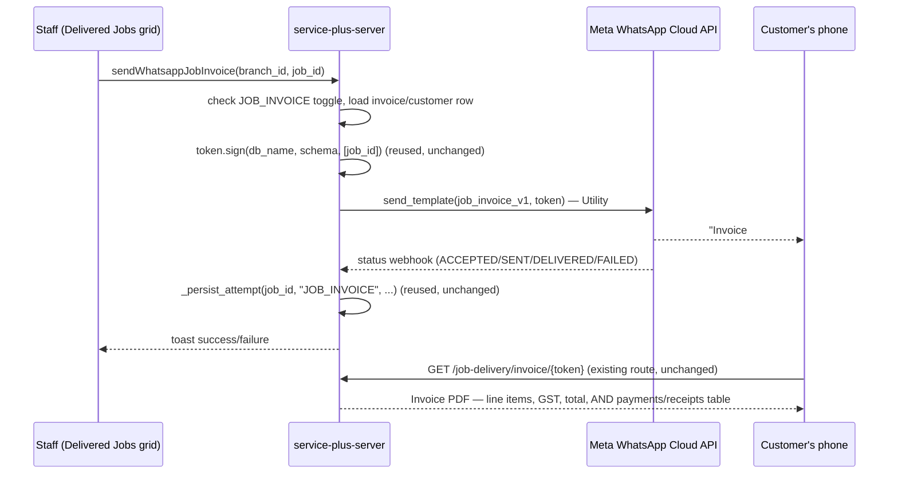

# WhatsApp Invoice Resend After Delivery — Design (not implemented yet)

## Goal

Let staff (re)send the customer an "Invoice + Money Receipt" WhatsApp message
for a job **after** it has already been delivered and closed — a gap today,
since the only existing WhatsApp-invoice trigger lives inside the live
Deliver Job session and disappears the moment that session ends.

New "Send Invoice via WhatsApp" action on the **Delivered Jobs** grid, one
Utility template, one **"Download Invoice"** button. The served PDF already
embeds the payments/receipts table — nothing new to build there — so one
button covers "invoice with money receipt" in a single document. Fourth
lightweight WhatsApp event, closest in shape to `JOB_MONEY_RECEIPT` (Utility,
no OTP, fire-and-forget) but even simpler: no array bookkeeping, no new PDF
route.

## The bug, confirmed

- **Where the "Download Invoice" WhatsApp button already exists today:**
  `WhatsappDeliveryControl`, rendered in `delivery-modal.tsx:1165-1174`, only
  when `isDelivered && firstJob` — i.e. only while the Deliver Job modal is
  still open, right after the delivery mutation just ran in that same
  session. It sends the `JOB_DELIVERY` template (`job_delivery_notice_v1`,
  two buttons: Download Delivery Note + Download Invoice) *and* a companion
  OTP message (`plans/plan-delivery.md`).
- **Why it's unreachable afterwards:** `delivery-modal.tsx` is only ever fed
  from `GET_DELIVERABLE_JOBS_DETAIL_MULTI`
  (`deliver-job-section.tsx:247,274`), and the query behind the grid that
  opens it — `GET_DELIVERABLE_JOBS_PAGED` — filters `is_final = true AND
  is_closed = false`. The moment a job is delivered, accounts posting closes
  it in the same flow ("Gates `is_closed`? No — confirmation is
  informational only," `plan-delivery.md`'s Design decisions), so it drops
  out of the Deliverable grid immediately. There is no code path that reopens
  `delivery-modal.tsx` (or `WhatsappDeliveryControl`) for an already-closed
  job.
- **What *is* reachable post-closure:** the **Delivered Jobs** grid
  (`delivered-jobs-grid.tsx`), fed by `GET_DELIVERED_JOBS_PAGED`
  (`sql_jobs.py:1694`, `WHERE ... j.is_closed = true`). Its Actions dropdown
  (`delivered-jobs-grid.tsx:367-391`) already has View, Attach Files,
  Delivery Note, and — gated on `row.invoice_no`
  (`delivered-jobs-grid.tsx:377-380`) — **"Invoice + Receipts"**, which
  re-renders the same jsPDF invoice client-side
  (`use-delivered-job-actions.tsx:87-113`, `handleInvoiceReceipts` →
  `buildInvoicePdf`). It has no WhatsApp option at all.
- **`JOB_MONEY_RECEIPT` doesn't close this gap**, despite already being
  fully shipped (`plans/plan-money-receipt.md`, all steps ✅ Done): it sends
  one **payment row's** receipt only (`receipts-section.tsx`'s Receipts
  grid, scoped per `job_payment.id`), never the invoice, and isn't reachable
  from Delivered Jobs either.

## What already exists (reused almost entirely as-is)

```
server  app/whatsapp/{sender.py, templates.py, token.py, client.py}
            token.py     sign(db_name, schema, job_ids, ttl_days=730) /
                          verify(token) — generic HMAC link token, NOT
                          OTP-gated, NOT status-checked. Already used by three
                          unrelated routes. Minting a fresh token for one
                          job_id and handing it to the EXISTING invoice route
                          works today with zero server PDF/route changes.
            sender.py    _EVENT_CODE_BY_KEY (line 131) — add one entry.
                          _is_event_enabled() (line 134) — reuse unchanged.
                          _persist_attempt() (~line 280) — the FLAT
                          per-event-key writer JOB_CREATION/COMPLETION/
                          DELIVERY already use (NOT
                          _persist_receipt_attempt's array variant — a job
                          has one invoice, not many payments, so this event
                          doesn't need JOB_MONEY_RECEIPT's array shape).
        app/routers/public/job_delivery_router.py
            GET /job-delivery/invoice/{token} (line ~780) — already serves
            the reportlab Invoice PDF (division/customer header, line items,
            GST, AND a payments/receipts table — `_InvoiceData.jobs[].payments`,
            line ~379) from nothing but `verify(token)`'s job_ids. No status
            check, no OTP requirement to view. Reused unchanged — this
            design mints a new token for it, nothing else.
        app/db/sql/sql_jobs.py
            GET_DELIVERED_JOBS_PAGED (line 1694) — already the source for
            the Delivered Jobs grid; already returns invoice_no,
            invoice_is_posted needed for the new action's gating.
            SET_JOB_WHATSAPP_ATTEMPT/_OUTCOME — already event_key-
            parameterized, reused unchanged.
        app/graphql/resolvers/mutation.py
            sendWhatsappMoneyReceipt (line 464) — the pattern the new
            sendWhatsappJobInvoice resolver copies almost verbatim (same
            "no dedicated access-right guard, the calling screen's own right
            already gates it" precedent).
client  jobs/receipts/use-send-whatsapp-money-receipt.tsx — confirm-before-
            send (Yes/No, default No) + in-flight state + toast pattern,
            copied directly for the new hook.
        jobs/send-whatsapp-money-receipt.ts — {results, disabled} mutation
            wrapper pattern, copied directly.
        jobs/whatsapp-status-cell.tsx, jobs/customer-connect/
            whatsapp-log-section.tsx, GET_WHATSAPP_EVENT_LOG_PAGED/_COUNT —
            generic, eventKey-parameterized, reusable UNCHANGED (unlike
            JOB_MONEY_RECEIPT, which needed its own sibling stack because its
            value is an array — JOB_INVOICE's value is a flat one-shot-per-job
            object, the same shape as JOB_CREATION/COMPLETION/DELIVERY).
        jobs/deliver-job/delivered-jobs-grid.tsx — Actions dropdown
            (line 367-391), "Invoice + Receipts" item (377-380) is the
            sibling slot the new "Send Invoice via WhatsApp" item sits next
            to, same `row.invoice_no` gate.
        jobs/deliver-job/use-delivered-job-actions.tsx — sibling hook the
            new send action lives alongside (not inside — that hook only
            builds/shows PDFs, never sends).
        jobs/customer-connect/customer-connect-section.tsx — 4-tab pattern
            (completion/intake/delivery/moneyReceipt, line 59 on) the new
            5th "Invoice" tab follows.
        configurations/app-settings/edit-whatsapp-notifications-dialog.tsx —
            WhatsappNotificationsValue + rows (lines 28-33, 105-110) — add
            one key/row.
```

## Design decisions

| Question | Decision |
|---|---|
| What gets sent | One Utility message: customer name, invoice no, amount, job reference, one **"Download Invoice"** button. No second message, no code — same fire-and-forget shape as `JOB_MONEY_RECEIPT`. |
| Does it also cover "money receipt"? | Yes, in the same document — the existing Invoice PDF (`_load_invoice_data`/`_build_invoice_pdf`, `job_delivery_router.py`) already renders a payments/receipts table alongside the line items. One button, one PDF, both covered. No separate "Download Receipt" button needed here (that already exists as its own `JOB_MONEY_RECEIPT` flow, per-payment, for staff who want just the receipt). |
| Channel | New template `job_invoice_v1` (Utility, `button_count=1`, "Download Invoice") — same shape class as `job_money_receipt_v1`. |
| Scope | Exactly one job per send, matching `handleInvoiceReceipts`' existing per-row scope. Delivered Jobs grid rows are one-job-at-a-time (no multi-select there today) — no chunking/grouping logic needed. |
| Trigger | New "Send Invoice via WhatsApp" item in `delivered-jobs-grid.tsx`'s row Actions dropdown, next to "Invoice + Receipts," same `row.invoice_no` gate (no invoice → nothing to send). |
| Token | Reuse `token.py`'s existing `sign(db_name, schema, [job_id])` unchanged — no new signing pair, no new secret. It was already built generic ("a digital stand-in for a paper slip a customer may need a year later," `token.py:33-35`), not OTP-specific; only `JOB_DELIVERY`'s own *confirmation* step needs a code, not the PDF link itself. |
| PDF / route | **No new PDF, no new route.** Reuse `GET /job-delivery/invoice/{token}` as-is — it already accepts any valid token for any job_id(s), regardless of delivery/closure status (confirmed: `_load_invoice_data` only calls `verify()` and queries by `job_ids`, no status filter). |
| Confirmation / proof | None — same as `JOB_MONEY_RECEIPT`. This is a convenience resend of a document already issued, not a new event needing staff verification. |
| Attempt/outcome tracking | New `JOB_INVOICE` key in `job.whatsapp_notifications`, **flat object** (not an array) — one job has one invoice, so this reuses `SET_JOB_WHATSAPP_ATTEMPT`/`_OUTCOME` and `_persist_attempt` completely unchanged, unlike `JOB_MONEY_RECEIPT`'s array special-case. A resend simply overwrites the same ladder (`attempt_count`/`last_status`/etc.), same as re-running `JOB_CREATION` or `JOB_COMPLETION` today. |
| Toggle | New `JOB_INVOICE` key in the `whatsapp_notifications` app_setting + a new row in `EditWhatsappNotificationsDialog`, same per-BU on/off precedent as the existing four. |
| Where triggered from | Delivered Jobs grid only, for now — the natural "already delivered, needs a resend" screen. (Not added to `delivery-modal.tsx`'s live session — that flow already has its own Download Invoice button via `JOB_DELIVERY`.) |
| Customer Connect tab | New 5th tab, "Invoice," alongside Job Completion/Job Intake/Job Delivery/Money Receipt — read-only log. **Reuses `WhatsappLogSection`/`WhatsappLogGrid`/`WhatsappStatusCell`/`GET_WHATSAPP_EVENT_LOG_PAGED` unchanged**, parameterized `eventKey="JOB_INVOICE"` — unlike Money Receipt's tab, no new sibling components needed, because the data shape is flat, not an array. |
| Access rights | No dedicated guard — same precedent as `sendWhatsappMoneyReceipt`/`sendWhatsappJobDelivery`: the Delivered Jobs screen's own existing access right already gates the entry point. |

## Data model

`job.whatsapp_notifications` gains a fourth key, shaped exactly like the
three existing flat ones (`JOB_CREATION`/`JOB_COMPLETION`/`JOB_DELIVERY`),
**not** like `JOB_MONEY_RECEIPT`'s array:

```jsonc
// job.whatsapp_notifications
{ "JOB_INVOICE": {
    "attempt_count": 1, "success_count": 1, "fail_count": 0,
    "last_wamid": "...", "last_status": "DELIVERED",
    "last_sent_at": "...", "last_error": null
} }
```

No OTP/confirmation fields — same as `JOB_MONEY_RECEIPT`, this event has no
completion state to track beyond "was it sent."

## Meta template — `job_invoice_v1`

**Approved by Meta 2026-09-04**, exactly as drafted below — no changes
needed on resubmission, unlike `job_intake_notice_v1`'s button-URL saga
(`plan-whatsapp.md`) or `job_delivery_notice_v1`'s v1→v2 rewrite.
`TEMPLATES["JOB_INVOICE"]` in `templates.py` (Step 1, done) already matches
this wording field-for-field — no template-side code changes needed now
that it's live.

Plain Utility, no companion Authentication send — nothing in this body is a
numeric confirmation code, so none of `JOB_DELIVERY`'s classification risk
(`plan-delivery.md`'s Step 3 "two templates for one event" story) applies
here. Same `button_count=1`, single-Dynamic-URL-button shape as
`job_money_receipt_v1`, and it reuses that template's **exact button URL
prefix** — `https://serviceplus.cloudjiffy.net/job-delivery/invoice/` is
already live (registered for `job_delivery_notice_v1`'s Button 2), so this
new template points at the same route, just minted with a fresh token. No
new nginx location block, no new PDF route to get approved alongside it.

**Registered wording** (submit to Meta exactly as below):

```
Name:     job_invoice_v1
Language: en
Category: UTILITY

Header: Invoice from {{business_unit}} team
Body:   Hi {{customer_name}},
        Here's your invoice {{invoice_no}} for {{reference_line}} —
        {{amount_line}}.
        Branch: {{branch_name}}  Contact: {{branch_contact}}.
        Thank you for choosing us.
Footer: This is an automated message.
Button 1: "Download Invoice" — Dynamic URL, bare prefix
          https://serviceplus.cloudjiffy.net/job-delivery/invoice/,
          no placeholder text (same registration discipline every other
          dynamic-URL button here already needed — Meta appends the sent
          token to this bare prefix, it does not substitute a placeholder
          in-place).
          Sample URL (for Meta's "Website URL" sample field during
          submission): https://serviceplus.cloudjiffy.net/job-delivery/invoice/c2VydmljZV9wbHVzX2RlbW98ZGVtbzF8NTM5Mw
```

Named params, in order (Meta rejects positional `{{1}}` placeholders for
Utility templates — header/body must be all-named):

- Header: `business_unit` — sample: `Cellcare Services`
- Body:
  - `customer_name` — sample: `Rahul Sharma`
  - `invoice_no` — sample: `INV-2026-00842`
  - `reference_line` — sample: `Job No: JOB-1024`
  - `amount_line` — sample: `Amount: ₹5,200.00 (Paid in full)`
  - `branch_name` — sample: ``
  - `branch_contact` — sample: `080-4123 5566`

`amount_line` reuses `_build_amount_line`'s existing pattern
(`sender.py`, built for `JOB_DELIVERY`): `"Amount: ₹5,200.00 (Paid in
full)"` or `"Amount: ₹5,200.00 (Balance due: ₹1,200.00)"` depending on
`invoice.amount` vs. the job's recorded payments — never just a bare
number, so the customer sees payment status without opening the PDF.
`reference_line` is a single job reference (`"Job No: JOB-1024"`, reusing
`_format_job_no`) — never a batch framing, since this event is always
one job, one send.

`app/whatsapp/templates.py` addition:

```python
    # One send per job, from the Delivered Jobs grid — a resend path for
    # jobs that already left the live paperless-delivery session
    # (plans/plan.md). Plain Utility like JOB_MONEY_RECEIPT; reuses
    # JOB_DELIVERY's already-approved /job-delivery/invoice/ button prefix,
    # just minted with a fresh token — no new PDF route.
    "JOB_INVOICE": TemplateSpec(
        name="job_invoice_v1",
        language="en",
        category="UTILITY",
        header_params=["business_unit"],
        body_params=[
            "customer_name",
            "invoice_no",
            "reference_line",
            "amount_line",
            "branch_name",
            "branch_contact",
        ],
        # "Download Invoice" — single dynamic-URL button, same bare-prefix
        # registration discipline every other dynamic-URL button here needs.
        button_count=1,
    ),
```

**Sample values for Meta's template review**:

| Field | Sample value |
|---|---|
| `business_unit` | `Cellcare Services` |
| `customer_name` | `Rahul Sharma` |
| `invoice_no` | `INV-2026-00842` |
| `reference_line` | `Job No: JOB-1024` |
| `amount_line` | `Amount: ₹5,200.00 (Paid in full)` |
| `branch_name` | `MG Road Branch` |
| `branch_contact` | `080-4123 5566` |
| Button 1 sample destination | `https://serviceplus.cloudjiffy.net/job-delivery/invoice/c2VydmljZV9wbHVzX2RlbW98ZGVtbzF8NTM5Mw` |

Rendered preview (what Meta's reviewer, and the customer, actually see):

```
┌─────────────────────────────────────────┐
│ Invoice from Cellcare Services team      │
│                                           │
│ Hi Rahul Sharma,                         │
│ Here's your invoice INV-2026-00842 for   │
│ Job No: JOB-1024 — Amount: ₹5,200.00     │
│ (Paid in full).                          │
│ Branch: MG Road Branch  Contact:         │
│ 080-4123 5566.                           │
│ Thank you for choosing us.               │
│                                           │
│ This is an automated message.            │
│ ┌───────────────────────────────────┐   │
│ │        Download Invoice            │   │
│ └───────────────────────────────────┘   │
└─────────────────────────────────────────┘
```

`sender.py` addition (mirrors `_build_money_receipt_params`, single row,
no grouping — an invoice send is always one job, one message):

```python
def _build_invoice_params(bu_name: str, row: dict) -> tuple[list[str], list[str]]:
    """header_values, body_values for one Invoice Notice send — order
    matches TEMPLATES["JOB_INVOICE"]'s header_params/body_params. Never
    grouped (one job is always one message), same precedent as
    _build_money_receipt_params."""
    header_values = [_truncate_business_unit(bu_name)]
    body_values = [
        row["customer_name"],
        row["invoice_no"],
        _build_delivery_reference_line([row["job_no"]]),
        _build_amount_line(row["invoice_amount"], row["paid_amount"]),
        row["branch_name"],
        row["branch_phone"] or "-",
    ]
    return (
        [_sanitize(v) for v in header_values],
        [_sanitize(v) for v in body_values],
    )
```

## Workflow



## Implementation steps (proposed, not started)

1. **Server — ✅ Done.** Implemented exactly as drafted, one deviation
   worth recording:
   - `sql_jobs.py` — new `GET_JOB_INVOICE_FOR_WHATSAPP_SEND` (added next to
     `GET_JOB_PAYMENT_FOR_WHATSAPP_SEND`), `INNER JOIN job_invoice` so a
     job with no invoice yet simply returns no rows (defense-in-depth
     behind the client's own `row.invoice_no` gate), same `branch_id`
     cross-check discipline as the other `GET_*_FOR_WHATSAPP_*` queries. No
     new write query — `JOB_INVOICE` reuses `SET_JOB_WHATSAPP_ATTEMPT`/
     `_OUTCOME` unchanged (confirmed generic: `ARRAY[%(event_key)s]`
     jsonb path, no hardcoded key list to extend).
   - `templates.py` — `TEMPLATES["JOB_INVOICE"]` registered exactly as
     specced above.
   - `sender.py` — `"JOB_INVOICE": "JI"` added to `_EVENT_CODE_BY_KEY`;
     `_build_invoice_params()` added, **one deviation from the literal
     draft**: `_build_amount_line()` actually takes `jobs: list[dict]`
     (sums `amount`/`paid_amount` across the list), not two scalar
     arguments as an earlier draft of this plan showed — so this calls
     `_build_amount_line([row])` (a one-element list) rather than
     `_build_amount_line(row["invoice_amount"], row["paid_amount"])`.
     Confirmed by reading `_build_amount_line`'s real signature, not
     assumed; behavior is identical either way, since `row` already
     carries `amount`/`paid_amount` keys matching what that helper reads
     off each list element. `send_whatsapp_job_invoice()` added, mirroring
     `send_whatsapp_money_receipt` — no OTP, no chunking, `token.py`'s
     existing `sign()` reused unchanged.
   - `whatsapp_webhook_router.py` — `"JI": "JOB_INVOICE"` added to
     `_EVENT_KEY_BY_CODE` (same fix `plan-money-receipt.md` needed for
     `"MR"`, otherwise every status callback logs a spurious
     "cannot resolve tenant" warning). Unlike `JOB_MONEY_RECEIPT`'s
     no-op case, `JOB_INVOICE` is flat like `JOB_DELIVERY` — its
     `SET_JOB_WHATSAPP_OUTCOME` call actually applies here, so
     `success_count`/`last_status` DO advance to DELIVERED/READ over
     time, not just the initial send attempt.
   - `mutation.py` — `sendWhatsappJobInvoice` resolver added, mirroring
     `resolve_send_whatsapp_money_receipt`'s no-dedicated-guard precedent.
   - `schema.graphql` — `sendWhatsappJobInvoice(db_name: String!, schema:
     String, value: String!): Generic` added to `type Mutation`, next to
     `sendWhatsappMoneyReceipt`.

   Verified without a live DB or Meta credentials (none available in this
   environment, same limitation `plan-money-receipt.md`'s own Step 3
   flagged): `ast.parse` on all five touched Python files confirms valid
   syntax; a full `import app.main` (which would confirm the Ariadne
   schema builds and every resolver/import resolves) could not run here —
   no `fastapi`/project virtualenv installed in this environment. **A
   clean `import app.main` (or equivalent app boot) is the one thing still
   outstanding before calling Step 1 fully verified** — recommend running
   it in a real dev environment before this reaches production, same
   "smoke test before trusting it" discipline `plan-money-receipt.md`
   flagged for its own new query.
2. **Meta template submission — ✅ Done.** `job_invoice_v1` approved by
   Meta 2026-09-04, exactly as registered above — first submission
   accepted as-is, no button-URL correction round needed the way
   `job_intake_notice_v1`/`job_delivery_notice_v1` each needed one
   (`plan-whatsapp.md`, `plan-delivery.md`). Nothing further to do here —
   an approved template can't be edited, so any future wording change
   would need a new `_v2` name, not a change to this one.
3. **Client — send trigger — ✅ Done.** Implemented exactly as drafted:
   - `graphql-map.ts` — new `sendWhatsappJobInvoice` gql mutation entry,
     next to `sendWhatsappMoneyReceipt`.
   - `jobs/send-whatsapp-job-invoice.ts` — mutation wrapper, copied from
     `send-whatsapp-money-receipt.ts` with `payment_id` swapped for
     `job_id` throughout (`WhatsappJobInvoiceResult`,
     `sendWhatsappJobInvoice(dbName, schema, branchId, jobId)`).
   - `jobs/deliver-job/use-send-whatsapp-job-invoice.tsx` — the confirm
     hook, copied verbatim from `use-send-whatsapp-money-receipt.tsx`
     (Yes/No confirm dialog defaulting No, in-flight `sending` state, same
     `MESSAGES.WHATSAPP_*` toasts) — placed under `jobs/deliver-job/`
     rather than `jobs/receipts/`, since that's where its one caller
     (`delivered-jobs-grid.tsx`) lives.
   - `delivered-jobs-grid.tsx` — new `onSendInvoiceWhatsapp: (row:
     DeliveredJobRow) => void` prop; new "Send Invoice via WhatsApp"
     `DropdownMenuItem` (green `WhatsAppIcon`, its brand colors fixed
     regardless of menu-item text color — see that component's own
     docstring) directly below "Invoice + Receipts," same `row.invoice_no`
     gate.
   - `deliver-job-section.tsx` — `useSendWhatsappJobInvoice()` instantiated
     alongside `useDeliveredJobActions()`; `onSendInvoiceWhatsapp` wired to
     `sendInvoiceWhatsapp.send(dbName, schema, branchId, row.id)`;
     `{sendInvoiceWhatsapp.ConfirmDialog}` rendered next to
     `deliveredActions.renderModals(...)`.

   Verified: `npx tsc -b --noEmit` — zero errors in any of the five files
   touched (the handful of pre-existing errors elsewhere in the project —
   unused `Button` imports, a missing `motion` import on an unrelated
   dashboard page — predate this change and are untouched by it).
4. **Client — settings toggle — ✅ Done.** `edit-whatsapp-notifications-dialog.tsx`:
   `JOB_INVOICE: boolean` added to `WhatsappNotificationsValue`,
   `obj.JOB_INVOICE === true` added to `toValue()`, and `{ key:
   "JOB_INVOICE", label: "Invoice" }` added to `rows`, in the same order
   as the other three touch points for `JOB_MONEY_RECEIPT`. Nothing else
   in the file changes — `toggle()`/`handleSave()` are already generic
   over every key in `WhatsappNotificationsValue`. Verified: `npx tsc -b
   --noEmit` — zero errors in this file.
5. **Client — Customer Connect tab — ✅ Done.** Implemented exactly as
   specced in "Customer Connect — Invoice tab" below: the `"JOB_CREATION" |
   "JOB_DELIVERY"` union widened to include `"JOB_INVOICE"` in
   `whatsapp-log-grid.tsx` and `whatsapp-log-section.tsx` (no other change
   in either file — `isDeliveryConfirmation={eventKey === "JOB_DELIVERY"}`
   already evaluates `false` for the new key for free); `ActiveTab` in
   `customer-connect-section.tsx` gained `"invoice"`; new `invoiceTotal`
   count state; `grid-cols-4` → `grid-cols-5`; new indigo "Invoice" tab
   button; new subtitle branch; new `<WhatsappLogSection
   eventKey="JOB_INVOICE" .../>` block next to the Money Receipt one — zero
   new components, as planned. Verified: `npx tsc -b --noEmit` shows no
   new errors from these three files — the one pre-existing `'Button' is
   declared but never read` error in `whatsapp-log-section.tsx` predates
   this change (its only edit here was the `eventKey` union on line 36,
   nothing touching imports) and matches the same class of pre-existing,
   unrelated lint-level errors already present elsewhere in this project
   before this feature's work began.
6. **Verification:** send from a real delivered+closed job, confirm the
   button in the WhatsApp message opens the invoice PDF with the payments
   table populated, confirm the Customer Connect "Invoice" tab shows the
   attempt, confirm the toggle actually suppresses the send when off, and
   confirm resending overwrites `attempt_count` rather than erroring.

## Customer Connect — Invoice tab

Read-only log, no send controls — the send trigger lives only on the
Delivered Jobs grid (Design decisions, "Where triggered from"). Same
category as the existing Job Intake / Job Delivery tabs: a **5th** tab,
"Invoice," in `customer-connect-section.tsx`. Because `JOB_INVOICE` is a
flat one-shot-per-job object (Data model, above) — the same shape as
`JOB_CREATION`/`JOB_DELIVERY`, not `JOB_MONEY_RECEIPT`'s array — this tab
needs **zero new components**: it reuses `WhatsappLogSection` →
`WhatsappLogGrid` → `WhatsappStatusCell` and `GET_WHATSAPP_EVENT_LOG_PAGED`/
`_COUNT` completely unchanged, exactly like the Job Delivery tab already
does. (Contrast `plan-money-receipt.md`'s Step 5, which needed a whole
sibling stack — `MoneyReceiptLogSection`/`MoneyReceiptLogGrid` — because
`JOB_MONEY_RECEIPT`'s array value doesn't fit that generic infrastructure.
Not needed here.)

**Three call sites currently hardcode the `"JOB_CREATION" | "JOB_DELIVERY"`
union — all three need `| "JOB_INVOICE"` added, nothing else:**

1. `whatsapp-log-grid.tsx:32` —
   ```ts
   eventKey: "JOB_CREATION" | "JOB_DELIVERY" | "JOB_INVOICE";
   ```
   No change needed to the body: `isDeliveryConfirmation={eventKey ===
   "JOB_DELIVERY"}` (line 123) already evaluates `false` for
   `"JOB_INVOICE"` without touching that line — correct behavior for free,
   since an invoice resend has no OTP/confirmation state to show, same as
   Job Intake today.
2. `whatsapp-log-section.tsx:36` — same widened union, passed straight
   through as a prop; no other change in that file.
3. `customer-connect-section.tsx` — the component itself:
   ```ts
   // line 56
   type ActiveTab = "completion" | "intake" | "delivery" | "moneyReceipt" | "invoice";
   ```

**`customer-connect-section.tsx` — the rest of the diff, each mirroring the
existing Job Delivery tab's own three touch points exactly:**

- New count state, alongside the other three (line 65-67):
  ```ts
  const [invoiceTotal, setInvoiceTotal] = useState(0);
  ```
- Subtitle line (line 408-411 today) gets a 5th branch:
  ```tsx
  {activeTab === "invoice" && `${invoiceTotal} logged message${invoiceTotal !== 1 ? "s" : ""}`}
  ```
- Tab strip: `grid-cols-4` → `grid-cols-5` (line 415), plus a 5th button
  after "Money Receipt" (line 448-456's block, copied and adjusted). Color:
  none of the existing four are reused (emerald=completion, sky=intake,
  violet=delivery, amber=moneyReceipt) — **indigo** for invoice, arbitrary
  but distinct:
  ```tsx
  <button
      className={`h-9 px-2 sm:px-4 text-xs sm:text-sm transition-transform duration-200 rounded-lg border-0 cursor-pointer ${activeTab === "invoice"
              ? "bg-indigo-600 text-white font-bold shadow-lg sm:scale-105 hover:brightness-110"
              : "bg-transparent text-(--cl-text-muted) hover:text-white hover:bg-indigo-600 sm:hover:scale-105 font-semibold"
          }`}
      onClick={() => setActiveTab("invoice")}
  >
      Invoice
  </button>
  ```
- New tab body, dropped in next to the Money Receipt block (after line
  484), same three-prop shape as the Job Delivery one three lines above it:
  ```tsx
  {/* Invoice — read-only log, no send controls */}
  {activeTab === "invoice" && (
      <WhatsappLogSection
          eventKey="JOB_INVOICE"
          emptyMessage="No Invoice messages have been sent yet."
          onCountChange={setInvoiceTotal}
      />
  )}
  ```

**Server side:** nothing — `GET_WHATSAPP_EVENT_LOG_PAGED`/`_COUNT`
(`sql_jobs.py:2315`/`2355`) already filter on `jsonb_typeof(
whatsapp_notifications -> event_key) = 'object'`, generic over
`event_key`, no hardcoded list of allowed keys to extend.

**Not covered by the live `whatsappDeliveryStatus` subscription** —
`customer-connect-section.tsx`'s subscription handler (line 188-260) only
ever patches `row.whatsapp_notifications.JOB_COMPLETION` (line 221,
hardcoded), so an Invoice-tab row sent while the tab happens to be open
won't live-update the way Job Completion rows do. This is not a gap
specific to this feature — the Job Intake, Job Delivery, and Money Receipt
tabs already have the exact same limitation today (a manual refresh via
`RefreshButton` is how each of those tabs already expects to pick up a
just-sent status). Left as-is, consistent with the other three log-only
tabs.

## Explicitly out of scope

- Changing anything about the existing `JOB_DELIVERY` live-session flow
  (`WhatsappDeliveryControl`, OTP, `job_delivery_notice_v1`) — unchanged,
  additive only.
- Multi-job / batch send from Delivered Jobs — that grid has no multi-select
  today; adding one is a separate change if ever needed.
- A standalone "Download Receipt only" button here — that's
  `JOB_MONEY_RECEIPT`'s job already; this event's PDF happens to include
  payments too, but the trigger and template stay separate.
- Fixing the pre-existing "serial number appears twice" issue in
  `job_delivery_router.py`'s `_build_invoice_pdf` (line ~569, same
  `device`/`serial_no` duplication pattern already fixed client-side in
  `deliver-job-pdf.ts` — see prior session). Worth a follow-up, not part of
  this feature.

## Watch-outs

- **Token TTL is 730 days, not tied to delivery/closure status at all** —
  once minted, the link works indefinitely (well past any conceivable resend
  need). No expiry-on-close logic exists or is needed; this is intentional
  ("a digital stand-in for a paper slip a customer may need a year later,"
  `token.py:33-35`), but worth stating plainly since it means a resent link
  never "goes stale" the way an OTP would.
- **Access-right gating is inherited, not new** — if the Delivered Jobs
  screen's existing right is ever tightened, this action rides along
  automatically; no separate right to remember to update.
- **Don't reuse `_persist_receipt_attempt`** — that's the array-shaped
  writer built specifically for `JOB_MONEY_RECEIPT`'s "several payments per
  job" case. `JOB_INVOICE` is one-per-job; using the wrong writer would
  silently create an unnecessary array wrapper.
- Same nginx-proxy trap `plan-delivery.md`'s Watch-outs already documents
  (the SPA catch-all intercepts anything not explicitly proxied) does **not**
  apply here — `/job-delivery/invoice/` is already proxied; no new nginx
  location block needed.
