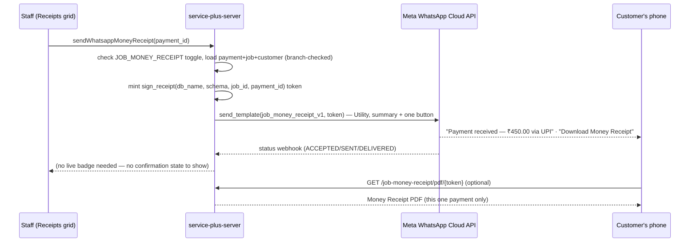

# WhatsApp-driven Money Receipt — Design (not implemented yet)

## Goal

Add a fourth WhatsApp send-trigger, alongside the existing three (Job Intake,
Job Completion, Job Delivery): "Send Receipt via WhatsApp" on a single
`job_payment` row, from Jobs → Receipts. One click sends the customer a
WhatsApp message with a "Download Money Receipt" button, serving a
server-built PDF that mirrors the manual receipt already printed today
(`buildReceiptPdf`, `deliver-job-pdf.ts`).

**Confirmed against a real manual receipt** (NAV Technology Pvt Ltd sample,
2026-09-03): division header (name/address/GSTIN), "PAYMENT RECEIPT" title,
Job No/Rcpt No/Job Date left, Customer name/address/phone right, one-row
Rcpt No/Date/Mode/Amount/Ref No/Remarks table, the disclaimer line, and
"Authorised Signatory" — matches `buildReceiptPdf`'s layout field-for-field.
The reportlab PDF should reproduce this exactly; no further confirmation
needed on layout.

## What already exists

- `receipts-section.tsx` — the Jobs → Receipts grid, row Actions dropdown
  (`MoreHorizontal` menu): View Job, Print Receipt, Edit, Delete
  (`receipts-section.tsx:566-598`). "Print Receipt" already calls
  `buildReceiptPdf(job, division, copies)` scoped to **one** payment row —
  `handleShowPdf` explicitly filters `payments.filter(p => p.id === row.id)`
  (`receipts-section.tsx:240`), never the job's full payment history. The new
  WhatsApp action must scope identically: one send = one receipt, never
  "every receipt on this job."
- `buildReceiptPdf` (`deliver-job-pdf.ts:1008-1180`) — the manual receipt's
  actual layout: division header (name/address/GSTIN), "PAYMENT RECEIPT"
  title, left column (Job No, Rcpt No, Job Date), right column (Customer
  name/address/phone), a one-row payments table (Rcpt No/Date/Mode/
  Amount/Ref No/Remarks), the same `MESSAGES.PDF_RECEIPT_DISCLAIMER` text
  the Invoice PDF already uses, "Authorised Signatory." Two copies per A4
  sheet (top/bottom half) when printed — the WhatsApp-served PDF is a single
  download, so it only needs one copy, not the two-up layout.
- Three existing WhatsApp events (`JOB_CREATION`, `JOB_COMPLETION`,
  `JOB_DELIVERY`) — `app/whatsapp/{templates,sender,client,token}.py`,
  `whatsapp_notifications` app_setting + `EditWhatsappNotificationsDialog`,
  per-job `job.whatsapp_notifications` jsonb attempt/outcome ladder
  (`SET_JOB_WHATSAPP_ATTEMPT`/`_OUTCOME`, flat fields directly under the
  event key — see Data model below for why this shape doesn't fit unchanged
  here), public token-gated PDF routers (`job_intake_router.py`,
  `job_delivery_router.py`, both reportlab, whitelisted-fields-only).
- `token.py` — signed link scheme, but payload is `(db_name, schema,
  job_ids)` only. A money receipt needs to identify one specific
  `job_payment` row, not just a job — today's payload shape has nowhere to
  put that. See Design decisions.
- **Customer Connect** (`customer-connect-section.tsx`) already has a
  3-tab pattern — "Job Completion" (the only tab that sends), "Job Intake"
  and "Job Delivery" (read-only message logs) — built from
  `WhatsappLogSection` → `GET_WHATSAPP_EVENT_LOG_PAGED`/`_COUNT` →
  `WhatsappLogGrid` → `WhatsappStatusCell`, parameterized by `eventKey:
  "JOB_CREATION" | "JOB_DELIVERY"`. **This entire stack assumes one row per
  job with a flat ladder object** — `GET_WHATSAPP_EVENT_LOG_PAGED`/`_COUNT`
  filter on `jsonb_typeof(whatsapp_notifications -> event_key) = 'object'`
  (`sql_jobs.py:2315`/`2355`), and `WhatsappStatusCell` reads
  `row.whatsapp_notifications?.[eventKey]` expecting one object
  (`whatsapp-status-cell.tsx:38`). `JOB_MONEY_RECEIPT`'s value is an **array**
  (Data model, below) and a job can have several receipts — this stack
  cannot be reused unmodified for a 4th "Money Receipt" tab. See Design
  decisions and Step 5.

## What "WhatsApp money receipt" means here

1. Staff clicks **"Send Receipt via WhatsApp"** on one Receipts-grid row.
2. Server sends **one** WhatsApp message (Utility category, no companion
   Authentication send — nothing in this message is a confirmation code, so
   none of `plan-delivery.md`'s Step 3 v2 rejection risk applies here):
   amount, mode, date, job/receipt reference, and a **"Download Money
   Receipt"** button.
3. The button serves a server-built PDF (reportlab), token-gated, scoped to
   that one `job_payment` row only.

No OTP, no confirmation loop, no staff-side verification step — unlike Job
Delivery, a receipt copy isn't proof of anything happening; it's a
convenience copy of a payment already recorded. This makes the feature
structurally closer to `JOB_CREATION`/`JOB_COMPLETION` (one Utility template,
fire-and-forget) than to `JOB_DELIVERY`.

## Design decisions

| Question | Decision |
|---|---|
| What gets sent | One Utility template: amount, mode, date, job reference, receipt no + one "Download Money Receipt" button. No second message, no code. |
| Channel | New template `job_money_receipt_v1` (Utility, `button_count=1`) — closest shape to `JOB_DELIVERY_OTP`'s single-button pattern, but Utility category like `JOB_CREATION`/`JOB_COMPLETION`, not Authentication. |
| Scope | Exactly one `job_payment` row per send, matching `handleShowPdf`'s existing per-row filter — never a job's full payment history. |
| Trigger | New "Send Receipt via WhatsApp" item in `receipts-section.tsx`'s row Actions dropdown, next to "Print Receipt" — same UI slot precedent as `WhatsappDeliveryControl` sitting next to "Delivery Note" in `delivery-modal.tsx`. |
| Token payload | Today's `token.py` `sign(db_name, schema, job_ids)` can't identify one payment row. Add a **new, separate** signing pair — `sign_receipt(db_name, schema, job_id, payment_id)` / `verify_receipt(token)` — same HMAC-SHA256 scheme and helpers (`_b64url`, `_signature`), new payload layout (`db_name\|schema\|job_id\|payment_id\|exp`). Deliberately not overloading `job_ids` with a second meaning. |
| Confirmation / proof | None. No OTP, no `confirmed_at`, no manual-override control — this event has no completion state to track beyond "was it sent." |
| Attempt/outcome tracking | `job.whatsapp_notifications` stays the single home for all WhatsApp logs on a job — new `JOB_MONEY_RECEIPT` key, valued as an **array** (one element per `payment_id`), not a new column elsewhere. See Data model for the write-query shape this needs. |
| Toggle | New `JOB_MONEY_RECEIPT` key in the `whatsapp_notifications` app_setting + a new row in `EditWhatsappNotificationsDialog.tsx`'s `WhatsappNotificationsValue`/`rows`, same per-BU on/off precedent as the existing three. |
| PDF content | Mirrors `buildReceiptPdf`'s layout (division header, "PAYMENT RECEIPT" title, Job No/Rcpt No/Job Date + Customer block, one-row payments table, disclaimer, Authorised Signatory) — single copy, not the two-up print layout. Reimplemented in reportlab from whitelisted public fields, same "don't share code across languages/apps" precedent `job_intake_router.py`/`job_delivery_router.py` already set for their own PDFs. **Confirmed** against a real manual receipt sample — layout is final. |
| Route | New public router `app/routers/public/job_money_receipt_router.py`, `GET /job-money-receipt/pdf/{token}` — same shape as `job_delivery_router.py` (`SimpleDocTemplate`, whitelisted public SQL, plain 404 on a bad token). |
| nginx | New `location /job-money-receipt/` block, same precedent `/job-intake/` and `/job-delivery/` already needed (the SPA's catch-all intercepts anything not explicitly proxied first — this already bit the codebase once per `plan-delivery.md`'s Watch-outs). |
| Grouping / chunking | None needed. Unlike the other three events, a receipt send is inherently one row → one customer → one message — no `MAX_JOBS_PER_WHATSAPP_MESSAGE` chunking logic applies. |
| Where triggered from | The **send** itself only ever happens from the Receipts grid (`receipts-section.tsx`) — no second send entry point, since receipts are only ever listed there. A separate, read-only **view** of what's been sent lives in Customer Connect (next row) — viewing is not a second way to trigger a send. |
| Customer Connect tab | New 4th tab, "Money Receipt," alongside Job Completion/Job Intake/Job Delivery — read-only log, same category as Job Intake/Job Delivery (no send controls). **Cannot reuse `WhatsappLogSection`/`WhatsappLogGrid`/`WhatsappStatusCell`/`GET_WHATSAPP_EVENT_LOG_PAGED` as-is** — that whole stack assumes one row per job with a flat ladder object (see "What already exists"); `JOB_MONEY_RECEIPT` is an array, and a job can have several receipts, each needing its own log row (Receipt No, Amount, Mode, its own status), not one row per job. New sibling components + new SQL — see Step 5. |

## Data model

**`job.whatsapp_notifications` stays the single home for every WhatsApp log
on a job** — no new column on `job_payment`. A job can have several
receipts, so `JOB_MONEY_RECEIPT`'s value is an **array**, one element per
`payment_id`, unlike the other three events' flat one-shot-per-job object:

```jsonc
// job.whatsapp_notifications
{ "JOB_MONEY_RECEIPT": [
    { "payment_id": 231, "attempt_count": 1, "success_count": 1, "fail_count": 0,
      "last_wamid": "...", "last_status": "DELIVERED", "last_sent_at": "...", "last_error": null },
    { "payment_id": 245, "attempt_count": 1, "success_count": 0, "fail_count": 1,
      "last_wamid": "...", "last_status": "FAILED", "last_sent_at": "...", "last_error": "..." }
  ]
}
```

No `otp_*`/`confirmed_*` fields at all — this event has no confirmation
state, unlike `JOB_DELIVERY`.

**Why not a flat nested object instead** (`{"JOB_MONEY_RECEIPT": {"<payment_id>":
{...}}}`) — an array keeps `payment_id` as ordinary row data inside each
element rather than as a dynamic object key, which is friendlier to query
back with `jsonb_array_elements` and matches how this codebase already
shapes other per-row jsonb collections, rather than encoding an id into a
JSON key path.

**New write query needed — `SET_JOB_MONEY_RECEIPT_WHATSAPP_ATTEMPT`/`_OUTCOME`.**
`SET_JOB_WHATSAPP_ATTEMPT`/`_OUTCOME` (`sql_jobs.py:1954-2040`) assume
`whatsapp_notifications -> event_key` **is** the flat ladder object itself —
their `jsonb_set` chain writes one level deep at a fixed path. An array
needs a genuinely different shape: **find the array element whose
`payment_id` matches, replace it in place; if none matches, append a new
element** — not a drop-in reuse of the existing queries. Postgres has no
single builtin for "upsert into a jsonb array by key," so this is a small
hand-rolled expression, roughly:

```sql
UPDATE job
SET whatsapp_notifications = jsonb_set(
    COALESCE(whatsapp_notifications, '{}'::jsonb),
    '{JOB_MONEY_RECEIPT}',
    COALESCE(
        (
            SELECT jsonb_agg(
                CASE WHEN elem ->> 'payment_id' = %(payment_id)s::text
                     THEN <merged attempt fields>
                     ELSE elem
                END
            )
            FROM jsonb_array_elements(
                CASE WHEN jsonb_typeof(whatsapp_notifications -> 'JOB_MONEY_RECEIPT') = 'array'
                     THEN whatsapp_notifications -> 'JOB_MONEY_RECEIPT' ELSE '[]'::jsonb END
            ) elem
        ),
        '[]'::jsonb
    )
    -- plus an append branch when no element matched payment_id — omitted here,
    -- worked out in full at implementation time, not in this design doc.
)
WHERE id = %(job_id)s
```

**Must be one atomic `UPDATE`, never read-modify-write in application
code** — two receipts on the same job sent close together must not race and
silently drop one array entry. Same "one transaction, not a partial write"
discipline `plan-delivery.md` already required for the OTP write, just for
a different reason (array-element loss instead of cross-job inconsistency).

## Workflow



## Implementation Steps

### Step 1 — Server foundation: token payload, public SQL, Money Receipt PDF route — ✅ Done

Implemented and verified as drafted, one cosmetic deviation: the payment
table's `colWidths` sketch (`[65, 60, 55, 70, None, None]`) wrapped the
ISO date ("2026-09-03") onto two lines at real render size — widened to
`[60, 68, 50, 68, None, None]`. Verified by running
`scripts/preview_job_money_receipt.py` and rendering both PDFs to PNG: the
"single" case (full division/customer/GSTIN data) and "minimal" case (no
receipt no yet, no division, no customer address) both render correctly,
matching the confirmed manual-receipt layout field-for-field. Also verified:
`app.main` imports cleanly with the router registered
(`/job-money-receipt/pdf/{token}` present in the route table), and
`sign_receipt`/`verify_receipt` round-trip correctly (valid token verifies,
tampered signature rejected, garbage input rejected) — checked directly, not
assumed from reading `verify`'s existing body.

- `app/whatsapp/token.py` — add a second signing pair, same module, same
  HMAC-SHA256 scheme and `_b64url`/`_signature` helpers as `sign`/`verify`,
  new pipe-delimited payload shape (`db_name|schema|job_id|payment_id|exp`):

  ```python
  def sign_receipt(db_name: str, schema: str, job_id: int, payment_id: int, ttl_days: int = 730) -> str:
      """Same 2-year TTL reasoning as `sign` — a receipt is as durable a
      record as a job slip, not a login session."""
      exp = int(time.time()) + ttl_days * 86400
      payload = f"{db_name}|{schema}|{job_id}|{payment_id}|{exp}"
      payload_b64 = _b64url(payload.encode("utf-8"))
      signature_b64 = _b64url(_signature(settings.whatsapp_link_token_secret.encode("utf-8"), payload_b64))
      return f"{payload_b64}.{signature_b64}"

  def verify_receipt(token: str) -> tuple[str, str, int, int] | None:
      """Decode and verify a receipt-link token. Returns
      `(db_name, schema, job_id, payment_id)`, or `None` on any failure —
      tampered, malformed, wrong field count, or expired — never raises."""
      try:
          payload_b64, signature_b64 = token.split(".", 1)
          given_signature = _b64url_decode(signature_b64)
      except ValueError:
          return None
      expected_signature = _signature(settings.whatsapp_link_token_secret.encode("utf-8"), payload_b64)
      if not hmac.compare_digest(given_signature, expected_signature):
          return None
      try:
          payload = _b64url_decode(payload_b64).decode("utf-8")
          db_name, schema, job_id_s, payment_id_s, exp_s = payload.split("|")
          job_id, payment_id, exp = int(job_id_s), int(payment_id_s), int(exp_s)
      except (ValueError, UnicodeDecodeError):
          return None
      if exp < int(time.time()):
          return None
      return db_name, schema, job_id, payment_id
  ```

  (Sketch, not final — `verify`'s exact error-handling shape in the current
  file should be followed precisely, including whatever it does for a
  constant-time signature comparison; reuse `verify`'s existing body as the
  template rather than retyping from scratch.)

- `app/db/sql/sql_public.py` — new `GET_JOB_PAYMENT_FOR_WHATSAPP_RECEIPT`,
  whitelisted columns only, `job_delivery_router.py`'s division/branch join
  shape reused directly:

  ```sql
  GET_JOB_PAYMENT_FOR_WHATSAPP_RECEIPT = """
      SELECT
          jp.receipt_no,
          jp.payment_date,
          jp.payment_mode,
          jp.amount,
          jp.reference_no,
          jp.remarks,
          j.job_no,
          j.alternate_job_no,
          j.job_date,
          b.name AS branch_name,
          d.name AS division_name,
          d.phone AS division_phone,
          d.email AS division_email,
          d.gstin AS division_gstin,
          TRIM(CONCAT_WS(', ', NULLIF(d.address_line1, ''), NULLIF(d.address_line2, ''),
                         NULLIF(d.city, ''), NULLIF(d.pincode, ''))) AS division_address,
          cc.full_name AS customer_name,
          cc.mobile AS customer_mobile,
          TRIM(CONCAT_WS(', ', NULLIF(cc.address_line1, ''), NULLIF(cc.address_line2, ''),
                         NULLIF(cc.landmark, ''), NULLIF(cc.city, ''), NULLIF(cst.name, ''),
                         NULLIF(cc.postal_code, ''))) AS customer_address
      FROM job_payment jp
      JOIN job j ON j.id = jp.job_id
      JOIN customer_contact cc ON cc.id = j.customer_contact_id
      LEFT JOIN state cst ON cst.id = cc.state_id
      JOIN branch b ON b.id = j.branch_id
      LEFT JOIN division d ON d.id = j.division_id
      WHERE jp.id = %(payment_id)s AND jp.job_id = %(job_id)s
  """
  ```

  (Both `payment_id` and `job_id` required in the `WHERE` — never trust one
  alone, same discipline `verify_receipt`'s two-id payload exists for.)

- `app/routers/public/job_money_receipt_router.py` (new) — `_ReceiptData`
  dataclass (fields matching the query above), `_load_receipt_data(token)`
  (calls `verify_receipt`, then the query above), `_build_receipt_pdf(data)`
  (reportlab, single copy — division header, "PAYMENT RECEIPT" title, Job
  No/Rcpt No/Job Date left, Customer block right, one-row payments table,
  `MESSAGES.PDF_RECEIPT_DISCLAIMER`-equivalent text, "Authorised
  Signatory," mirroring `buildReceiptPdf`'s confirmed layout), `GET
  /job-money-receipt/pdf/{token}` returning the PDF or a plain 404 (same
  `_raise_invalid_token` pattern as the other two public routers).
- No schema migration needed — `job.whatsapp_notifications` already exists;
  `JOB_MONEY_RECEIPT` is just a new key within it, written by the new
  `SET_JOB_MONEY_RECEIPT_WHATSAPP_ATTEMPT`/`_OUTCOME` queries (Data model).

**Test alone**: hand-build a `_ReceiptData` (or a `scripts/preview_job_money_receipt.py`
following the `preview_job_intake.py`/`preview_job_delivery.py` precedent)
and confirm the PDF renders correctly with no live send.

### Step 2 — nginx reverse proxy (production) — ✅ Done

Same failure mode `plan-delivery.md`'s Step 2 already fixed twice
(`/job-intake/`, then `/job-delivery/`): the SPA's catch-all `try_files`
intercepts any path with no matching `location` block before it ever
reaches FastAPI. Same fix, same shape, third time:

```
location /job-money-receipt/ {
    proxy_pass http://127.0.0.1:8000/job-money-receipt/;
    proxy_set_header Host $host;
    proxy_set_header X-Real-IP $remote_addr;
    proxy_set_header X-Forwarded-For $proxy_add_x_forwarded_for;
    proxy_set_header X-Forwarded-Proto $scheme;
}
```

1. `plan-delivery.md`'s Step 2 says this block is documented in
   `notes/Deployment.md`, edited there first so the doc and the live server
   never drift apart — **that file could not be located in either checked-out
   repo as of this writing** (searched both `service-plus-client` and
   `service-plus-server`); it may only exist on the production server, or
   under a different path/name now. Locate it first — don't skip straight to
   the live file on the assumption it doesn't exist.
2. Add the block above immediately after the existing `location
   /job-delivery/` block, in both the doc and the live file
   (`/etc/nginx/conf.d/service-plus-server.conf`, per `plan-delivery.md`'s
   Step 2).
3. `sudo nginx -t` — validate syntax before touching the running server.
4. `sudo nginx -t && sudo systemctl reload nginx` — reload, not restart, so
   in-flight connections (including open GraphQL subscription sockets)
   aren't dropped.
5. Verify from outside the server: `curl -sI
   https://<prod-host>/job-money-receipt/pdf/anything` should show FastAPI/uvicorn
   response headers, not openresty's static-file headers (`etag`,
   `last-modified`, `accept-ranges`) — the same diagnostic that caught the
   original `/job-intake/` gap.

### Step 3 — Meta template and the WhatsApp send path — ✅ Done

**`job_money_receipt_v1` approved by Meta 2026-09-03**, body/params exactly
as drafted below. Code implemented and verified — three deviations from the
literal draft, worth recording:

1. **`GET_JOB_PAYMENT_FOR_WHATSAPP_SEND` is a new query (`sql_jobs.py`,
   internal `SqlStore`), not a reuse of `GET_JOB_PAYMENT_FOR_WHATSAPP_RECEIPT`**
   (`sql_public.py`, Step 1) as the draft bullet implied. The two have
   different jobs: the public query is keyed by `(payment_id, job_id)` for
   an already-verified token and is whitelisted-columns-only for an
   anonymous caller; the sender needs `(payment_id, branch_id)` — before any
   token exists — plus `mobile`/`branch_phone` to actually place the send,
   which the public query correctly doesn't expose. Same
   public/internal separation this codebase already enforces everywhere
   else (`sql_public.py`'s own module docstring). Follows
   `GET_JOBS_FOR_WHATSAPP_CREATION`/`_DELIVERY`'s exact shape.
2. **`SET_JOB_MONEY_RECEIPT_WHATSAPP_ATTEMPT` worked out in full** (Data
   model's sketch left the append-branch as future work) — one atomic
   `UPDATE`, find-or-append by `payment_id`, verified by manual trace
   through all three cases (first send, resend of the same receipt, a
   second receipt on the same job) since no live Postgres was reachable to
   test directly in this environment. **Recommend a smoke test against a
   real dev DB before this reaches production** — everything else was
   verified (mocked send path, app import, GraphQL schema build), but this
   specific query was not run against a real engine.
3. **No `_OUTCOME` counterpart, and the webhook needed one small addition
   to stay correct**: `whatsapp_webhook_router.py`'s `_EVENT_KEY_BY_CODE`
   now includes `"MR": "JOB_MONEY_RECEIPT"` — without it, every money-receipt
   status callback logged a spurious "cannot resolve tenant" warning. With
   it, the callback decodes fine but the generic `SET_JOB_WHATSAPP_OUTCOME`
   it calls safely no-ops against `JOB_MONEY_RECEIPT`'s array value (its
   `WHERE` clause extracts `last_wamid` via `->>`, which is `NULL` for an
   array, so the row never matches) — confirmed by reading that query's
   `WHERE` clause, not assumed. This matches the design's own "no live
   badge, no confirmation state to show": `success_count`/`last_status`
   only ever reflect the initial send attempt, never advance to
   DELIVERED/READ.

- `app/whatsapp/templates.py` — `TEMPLATES["JOB_MONEY_RECEIPT"]`:
  registered Meta template name **`job_money_receipt_v1`** (Utility
  category, language `en`), `button_count=1`.

  ```
  Header: Payment update from {{business_unit}} team
  Body: Hi {{customer_name}},
        We've received your payment of {{amount_line}} via {{payment_mode}}
        on {{payment_date}} for {{reference_line}}.
        Receipt No: {{receipt_no}}
        Branch: {{branch_name}}  Contact: {{branch_contact}}.
        Thank you for choosing us.
  Footer: This is an automated message.
  Button 1: "Download Money Receipt" — Dynamic URL, bare prefix https://serviceplus.cloudjiffy.net/job-money-receipt/pdf/, no placeholder text.
  ```

  Named params: `business_unit`, `customer_name`, `amount_line`,
  `payment_mode`, `payment_date`, `reference_line` (reuse
  `_format_job_no`-style single job reference, never a batch framing — a
  payment always belongs to exactly one job), `receipt_no`, `branch_name`,
  `branch_contact`.

  **Sample values for Meta's template review**:

  | Field | Sample value |
  |---|---|
  | `business_unit` | `Cellcare Services` |
  | `customer_name` | `Rahul Sharma` |
  | `amount_line` | `₹450.00` |
  | `payment_mode` | `UPI` |
  | `payment_date` | `02 Sep 2026` |
  | `reference_line` | `Job No: JOB-1024` |
  | `receipt_no` | `RCT-00231` |
  | `branch_name` | `MG Road Branch` |
  | `branch_contact` | `080-4123 5566` |
  | Button 1 sample destination | `https://serviceplus.cloudjiffy.net/job-money-receipt/pdf/c2VydmljZV9wbHVzX2RlbW98ZGVtbzF8NTM5Mw` |

- `app/whatsapp/sender.py` — `send_whatsapp_money_receipt(db_name, schema,
  value)` where `value` decodes to `{branch_id, payment_id}`. Simplest of
  the four send functions — no grouping, no chunking, one row in, one
  message out: check `_is_event_enabled(..., "JOB_MONEY_RECEIPT")`; load via
  `GET_JOB_PAYMENT_FOR_WHATSAPP_RECEIPT(payment_id, branch_id)` (branch
  cross-check, same discipline as the other three); skip with the existing
  `FAILED — Invalid or missing mobile number` shape if the customer has no
  valid mobile; mint one `sign_receipt` token; one `send_template()` call;
  persist attempt/outcome via the new `SET_JOB_MONEY_RECEIPT_WHATSAPP_ATTEMPT`/
  `_OUTCOME` queries (Data model) — find-or-append into `job.
  whatsapp_notifications.JOB_MONEY_RECEIPT`'s array by `payment_id`, one atomic
  `UPDATE`.
- `app/graphql/resolvers/mutation.py` — `sendWhatsappMoneyReceipt` (`:
  Generic`), same no-guard precedent as the other three sends.
- `app/graphql/schema.graphql` — add `sendWhatsappMoneyReceipt` to `type
  Mutation`, next to `sendWhatsappJobDelivery`.

**Test alone**: with Steps 1-2 merged and the template approved, trigger
`sendWhatsappMoneyReceipt` for a real payment row, confirm the message
arrives with a working download button, confirm the PDF matches the one
payment row only. **Not yet done** — no live DB or Meta credentials were
available in this environment, so verification stopped at: `app.main`
importing cleanly with the schema built (proves `sendWhatsappMoneyReceipt`
has a matching resolver), and the full send path exercised with
`exec_sql_query`/`send_template`/`_persist_receipt_attempt` mocked (proves
the param-building, token-minting, callback-data, and disabled/invalid-
mobile/not-found branches all behave correctly). A real send to a real
phone is the one thing still outstanding before calling this fully verified.

### Step 4 — Client: Receipts grid action and mutation wrapper — ✅ Done

Implemented as drafted, with one addition beyond the literal plan text:
**a confirm-before-send dialog** (`use-send-whatsapp-money-receipt.tsx`, new
hook), matching the established precedent every other WhatsApp send trigger
in this codebase already follows (`use-send-whatsapp-job-intake.tsx`'s
Yes/No dialog, `WhatsappDeliveryControl`'s). The plan draft didn't call this
out, but skipping it would have been the one WhatsApp send action in this
codebase without that safety net — added for consistency, not scope creep.

- `jobs/send-whatsapp-money-receipt.ts` (new) — thin wrapper, same shape as
  `jobs/send-whatsapp-job-delivery.ts`, just `paymentId` in place of
  `jobIds`:

  ```ts
  import { GRAPHQL_MAP } from "@/constants/graphql-map";
  import { apolloClient } from "@/lib/apollo-client";
  import { encodeObj } from "@/lib/graphql-utils";

  export type WhatsappMoneyReceiptResult = {
      customer_name: string;
      payment_id:    number;
      status:        "SENT" | "FAILED";
      error:         string | null;
  };

  type SendWhatsappMoneyReceiptData = {
      sendWhatsappMoneyReceipt: { results: WhatsappMoneyReceiptResult[]; disabled?: boolean } | null;
  };

  export type WhatsappMoneyReceiptSendOutcome = {
      results:  WhatsappMoneyReceiptResult[];
      disabled: boolean;
  };

  export async function sendWhatsappMoneyReceipt(
      dbName: string,
      schema: string,
      branchId: number,
      paymentId: number,
  ): Promise<WhatsappMoneyReceiptSendOutcome> {
      const res = await apolloClient.mutate<SendWhatsappMoneyReceiptData>({
          mutation: GRAPHQL_MAP.sendWhatsappMoneyReceipt,
          variables: {
              db_name: dbName,
              schema,
              value: encodeObj({ branch_id: branchId, payment_id: paymentId }),
          },
      });
      return {
          results:  res.data?.sendWhatsappMoneyReceipt?.results ?? [],
          disabled: res.data?.sendWhatsappMoneyReceipt?.disabled ?? false,
      };
  }
  ```

  Also add `sendWhatsappMoneyReceipt` to `graphql-map.ts`, same gql tag
  shape as the existing `sendWhatsappJobDelivery` entry.

- `receipts-section.tsx` — new `DropdownMenuItem`, same slot the existing
  Actions menu already has (`receipts-section.tsx:580-583`), between "Print
  Receipt" and the separator before "Edit":

  ```tsx
  import { isValidMobile } from "@/lib/mobile";
  import { sendWhatsappMoneyReceipt } from "@/features/client/components/jobs/send-whatsapp-money-receipt";
  // ...
  <DropdownMenuItem
      disabled={!isValidMobile(row.mobile)}
      title={isValidMobile(row.mobile) ? undefined : "No valid mobile number on file"}
      onClick={() => void handleSendReceiptWhatsapp(row)}
  >
      <WhatsAppIcon className="mr-2 h-3.5 w-3.5" /> Send Receipt via WhatsApp
  </DropdownMenuItem>
  ```

  `handleSendReceiptWhatsapp(row)` (new function, same file) calls
  `sendWhatsappMoneyReceipt(dbName, schema, branchId, row.id)`, toasts the
  result (`MESSAGES`-style success/failure), same pattern
  `handleShowPdf`/`executeSave` already use for their own toasts.

- `edit-whatsapp-notifications-dialog.tsx` — add `JOB_MONEY_RECEIPT: boolean` to
  `WhatsappNotificationsValue` (`:28-32`), `toValue()` (`:43-50`), and
  `rows` (`:103-107`, label `"Money Receipt"`).

**Test alone**: click "Send Receipt via WhatsApp" on a real receipt row,
confirm the message + PDF, confirm the toggle off suppresses the send,
confirm a customer with no mobile shows a clear disabled state rather than a
silent failure.

### Step 5 — Customer Connect: "Money Receipt" 4th tab (read-only log) — ✅ Done

Implemented as drafted, one gap found and fixed along the way: **the
`WhatsappStatusCell` refactor's call-site list was incomplete.** The plan
only named `whatsapp-log-grid.tsx:120`, but `customer-connect-grid.tsx`
(the Job Completion tab's own grid) had a third call site
(`<WhatsappStatusCell row={row} eventKey="JOB_COMPLETION" />`) neither the
plan nor the initial refactor pass caught — `tsc -b` surfaced it immediately
as a type error, not a runtime surprise. Fixed the same way as the other
two: `<WhatsappStatusCell state={row.whatsapp_notifications?.JOB_COMPLETION ?? null} />`.

**Verification performed**: `tsc -b --noEmit` passes clean across the
entire project (zero errors, not just the touched files), and a full
`vite build` succeeds. `eslint` itself couldn't run in this environment
(a pre-existing `typescript-eslint`/TS-version mismatch, unrelated to this
change). **Not verified**: an actual authenticated browser session — no dev
login credentials were available in this environment to click through the
Receipts grid action or the new Customer Connect tab live. Recommend a
manual pass in a real browser session before considering this fully done,
same "not yet confirmed by a real send" caveat this plan already carries
for Step 3's Meta send.

- `app/db/sql/sql_jobs.py` — new `GET_JOB_MONEY_RECEIPT_WHATSAPP_LOG_PAGED`/
  `_COUNT`, one row **per receipt send**, not per job — the
  `jsonb_array_elements` lateral join `GET_WHATSAPP_EVENT_LOG_PAGED`/
  `_COUNT` (`sql_jobs.py:2305-2360`) doesn't need, since those assume a
  flat object:

  ```sql
  GET_JOB_MONEY_RECEIPT_WHATSAPP_LOG_COUNT = """
      with
          "p_branch_id" as (values(%(branch_id)s::bigint)),
          "p_search"    as (values(%(search)s::text))
      SELECT COUNT(*) AS total
      FROM job j
      JOIN customer_contact cc ON cc.id = j.customer_contact_id
      CROSS JOIN LATERAL jsonb_array_elements(j.whatsapp_notifications -> 'JOB_MONEY_RECEIPT') AS log_entry
      JOIN job_payment jp ON jp.id = (log_entry ->> 'payment_id')::bigint
      WHERE j.branch_id = (table "p_branch_id")
        AND jsonb_typeof(j.whatsapp_notifications -> 'JOB_MONEY_RECEIPT') = 'array'
        AND ((table "p_search") = ''
         OR  LOWER(j.job_no::text)                   LIKE '%%' || LOWER((table "p_search")) || '%%'
         OR  LOWER(COALESCE(j.alternate_job_no, '')) LIKE '%%' || LOWER((table "p_search")) || '%%'
         OR  LOWER(cc.full_name)                     LIKE '%%' || LOWER((table "p_search")) || '%%'
         OR  LOWER(cc.mobile)                        LIKE '%%' || LOWER((table "p_search")) || '%%'
         OR  LOWER(COALESCE(jp.receipt_no, ''))       LIKE '%%' || LOWER((table "p_search")) || '%%')
  """

  GET_JOB_MONEY_RECEIPT_WHATSAPP_LOG_PAGED = """
      with
          "p_branch_id" as (values(%(branch_id)s::bigint)),
          "p_search"    as (values(%(search)s::text)),
          "p_limit"     as (values(%(limit)s::int)),
          "p_offset"    as (values(%(offset)s::int))
      SELECT
          jp.id AS payment_id,
          j.id AS job_id,
          j.job_no,
          j.alternate_job_no,
          jp.receipt_no,
          jp.payment_date,
          jp.payment_mode,
          jp.amount,
          cc.id        AS customer_contact_id,
          cc.full_name AS customer_name,
          cc.mobile,
          log_entry    AS whatsapp_state
      FROM job j
      JOIN customer_contact cc ON cc.id = j.customer_contact_id
      CROSS JOIN LATERAL jsonb_array_elements(j.whatsapp_notifications -> 'JOB_MONEY_RECEIPT') AS log_entry
      JOIN job_payment jp ON jp.id = (log_entry ->> 'payment_id')::bigint
      WHERE j.branch_id = (table "p_branch_id")
        AND jsonb_typeof(j.whatsapp_notifications -> 'JOB_MONEY_RECEIPT') = 'array'
        AND ((table "p_search") = ''
         OR  LOWER(j.job_no::text)                   LIKE '%%' || LOWER((table "p_search")) || '%%'
         OR  LOWER(COALESCE(j.alternate_job_no, '')) LIKE '%%' || LOWER((table "p_search")) || '%%'
         OR  LOWER(cc.full_name)                     LIKE '%%' || LOWER((table "p_search")) || '%%'
         OR  LOWER(cc.mobile)                        LIKE '%%' || LOWER((table "p_search")) || '%%'
         OR  LOWER(COALESCE(jp.receipt_no, ''))       LIKE '%%' || LOWER((table "p_search")) || '%%')
      ORDER BY (log_entry ->> 'last_sent_at') DESC NULLS LAST
      LIMIT  (table "p_limit")
      OFFSET (table "p_offset")
  """
  ```

  `whatsapp_state` returns `log_entry` (the one array element) directly as
  its own jsonb value — the client-side row shape is then `{ ...,
  whatsapp_state: WhatsappCompletionState }`, fed straight into the
  refactored `WhatsappStatusCell` below without the caller needing to
  index into a per-event key itself.
- `whatsapp-status-cell.tsx` — **small, backward-compatible refactor**. Today's
  signature (`:37`) takes `{ row, eventKey }` and derives state internally;
  the only other thing `eventKey` drives is the `JOB_DELIVERY`-specific
  `hasConfirmation` branch (`:39`), so that becomes its own explicit flag
  instead of being inferred from `eventKey`:

  ```tsx
  // Before
  export function WhatsappStatusCell({ row, eventKey }: {
      row: WhatsappStatusRow;
      eventKey: "JOB_COMPLETION" | "JOB_CREATION" | "JOB_DELIVERY";
  }) {
      const state = row.whatsapp_notifications?.[eventKey] ?? null;
      const hasConfirmation = eventKey === "JOB_DELIVERY" && !!state?.confirmed_at && !!state.confirmation_method;
      // ...
  }

  // After
  export function WhatsappStatusCell({ state, isDeliveryConfirmation = false }: {
      state: WhatsappCompletionState | null;
      isDeliveryConfirmation?: boolean;
  }) {
      const hasConfirmation = isDeliveryConfirmation && !!state?.confirmed_at && !!state.confirmation_method;
      // ... rest of the body unchanged, already reads `state` not `row`/`eventKey`
  }
  ```

  Call sites: `whatsapp-log-grid.tsx:120` becomes
  `<WhatsappStatusCell state={row.whatsapp_notifications?.[eventKey] ?? null} isDeliveryConfirmation={eventKey === "JOB_DELIVERY"} />`
  (same resolved value as before, just computed at the call site instead of
  inside the component); the new Money Receipt grid passes
  `<WhatsappStatusCell state={row.whatsapp_state} />` (`isDeliveryConfirmation`
  left at its `false` default — a receipt is never a delivery confirmation).
  Keeps the pill-rendering logic (success/fail counts, last-status badge)
  shared across all four tabs instead of forking it.
- `jobs/customer-connect/money-receipt-log-section.tsx` /
  `money-receipt-log-grid.tsx` (new) — same toolbar/pagination/skeleton
  chrome as `whatsapp-log-section.tsx`/`whatsapp-log-grid.tsx`, but columns
  fit a receipt row: Date, Receipt No, Job No, Customer, Mobile, Amount,
  Mode, Whatsapp status, Actions (View Job) — not Device Details/Job
  Type/Job Status, which don't apply to a payment row the way they do to a
  job row.
- `customer-connect-section.tsx`:
  - `ActiveTab` widens to `"completion" | "intake" | "delivery" |
    "moneyReceipt"`; new `moneyReceiptTotal` state, same lifted-count
    pattern as `intakeTotal`/`deliveryTotal`.
  - Tab bar becomes 4 buttons — the header comment currently says "a
    3-column grid keeps the tab group visually centered" (`:395`) and the
    grid is literally `grid-cols-3` (`:410`); both need updating to
    4-column, plus a 4th button ("Money Receipt," its own accent color —
    amber, say, since emerald/sky/violet are already taken).
  - New `activeTab === "moneyReceipt"` branch rendering
    `MoneyReceiptLogSection`, same slot pattern as the intake/delivery
    branches (`:446-462`).

**Test alone**: open the Money Receipt tab, confirm it lists one row per
receipt send (not per job) with correct Receipt No/Amount/Mode/status,
confirm a job with two receipts sent shows two separate rows, confirm the
other three tabs render identically to before the `WhatsappStatusCell`
refactor (no regression).

## What doesn't change

- `job_payment` creation/edit/delete flow (`NewReceiptForm`, `executeSave`,
  `handleDelete`) — entirely unchanged.
- "Print Receipt" (`buildReceiptPdf`, client-side) — unchanged, stays the
  in-app printed path; the WhatsApp PDF is server-built and separate, same
  "don't share code across languages" split the other three events already
  have between client jsPDF and server reportlab.
- Accounts posting / `is_posted` — unaffected; this feature has no
  interaction with posting state.

## Explicitly out of scope

- Any confirmation/proof-of-receipt loop (no OTP, no read receipt beyond
  Meta's own delivery status webhook).
- Resending automatically on payment edit — a resend is always an explicit
  second click, same as the other three events.
- Attaching the PDF as a WhatsApp document/media attachment — button-link
  only, same precedent as the other three.
- A live "sent" badge in the grid — nothing here has a confirmation state
  worth showing; `last_status` from the outcome ladder is enough for a
  future message-log view (same `GET_..._WHATSAPP_LOG` precedent already
  built for the other three events), not drafted here.

## Watch-outs

- **Never let a "Download Money Receipt" token resolve more than one
  payment row** — `verify_receipt` must check both `job_id` and
  `payment_id` from the token against the row it loads, not just one.
- **The nginx `location /job-money-receipt/` block is not optional** — same
  class of bug that already bit `/job-intake/` and `/job-delivery/` once.
- **Register the button URL with no placeholder text** — bare prefix,
  "Dynamic URL" type, same first-submission discipline the other three
  templates needed (an approved template can't be edited).
- **`branch_id` must be a required, cross-checked argument** on
  `sendWhatsappMoneyReceipt`, exactly like the other three send functions —
  never let `payment_id` alone imply authorization for that row's branch.
- **A customer with no valid mobile has no way to receive this at all** —
  unlike Job Delivery, there's no manual-override equivalent needed here
  (nothing is being confirmed), so the UI only needs to disable the action
  with a clear reason, not offer a fallback flow.
- **The `JOB_MONEY_RECEIPT` write must be one atomic `UPDATE`, never
  read-modify-write in application code** — see Data model; two receipts on
  the same job sent close together must not race and silently drop one
  array entry.
- **`SET_JOB_MONEY_RECEIPT_WHATSAPP_ATTEMPT`/`_OUTCOME` are new queries, not a
  reuse of `SET_JOB_WHATSAPP_ATTEMPT`/`_OUTCOME`** — the existing pair
  assumes a flat object at `whatsapp_notifications -> event_key`; get the
  find-or-append array logic right in real SQL, the sketch in Data model is
  illustrative, not final.
- **Don't add `JOB_MONEY_RECEIPT` to `WhatsappLogSection`'s `eventKey` union and
  call it done** — the type would compile, but `GET_WHATSAPP_EVENT_LOG_PAGED`/
  `_COUNT`'s `jsonb_typeof(...) = 'object'` filter silently excludes every
  row (an array never satisfies it), producing an always-empty tab instead
  of an error. Money Receipt needs its own SQL/section/grid (Step 5), not a
  parameter value added to the existing ones.
- **The `WhatsappStatusCell` prop-contract change (Step 5) must not change
  what the three existing tabs render** — verify Job Completion/Intake/
  Delivery pills look identical before and after, since the refactor moves
  where `row.whatsapp_notifications?.[eventKey]` is read from, not what it
  reads.

## Verification

- `curl -sI https://<prod-host>/job-money-receipt/pdf/anything` reaches FastAPI
  (a token-decode error response), not the SPA's static-file headers.
- `JOB_MONEY_RECEIPT` send appends/updates only the array element matching that
  `payment_id` inside `job.whatsapp_notifications.JOB_MONEY_RECEIPT` — sending for
  a second receipt on the same job adds a second element, never overwrites
  the first.
- Two receipts on the same job sent in quick succession both end up
  correctly represented in the array afterward — no lost update from a
  race between the two writes.
- Toggling `whatsapp_notifications.JOB_MONEY_RECEIPT` off →
  `sendWhatsappMoneyReceipt` returns `disabled: true`, no Meta call.
- The Money Receipt PDF shows exactly one payment row, matching the grid
  row that triggered the send — not the job's full payment history.
- A tampered or expired token → clean 404-shaped rejection, never a 500 or
  partial-data leak.
- A customer with no valid mobile on file → the grid action is disabled
  with a clear reason, not a silent failure after clicking.
- "Send Receipt via WhatsApp" works identically regardless of the job's own
  status (open, closed, delivered) — a receipt can be resent long after the
  job itself is done.
- Customer Connect shows a 4th "Money Receipt" tab, tab bar laid out for
  four buttons (not three visually squeezed or wrapping oddly).
- A job with two receipts sent produces **two** rows in the Money Receipt
  tab, each with its own Receipt No/Amount/Mode/status — not one row, and
  not the two collapsed into each other.
- The Money Receipt tab's search (job no/customer/mobile) filters correctly
  even though its underlying query joins through `job_payment`, not just
  `job`.
- Job Completion/Job Intake/Job Delivery tabs render identical status pills
  after the `WhatsappStatusCell` refactor — no visual/behavioral regression
  from Step 5's prop-contract change.
