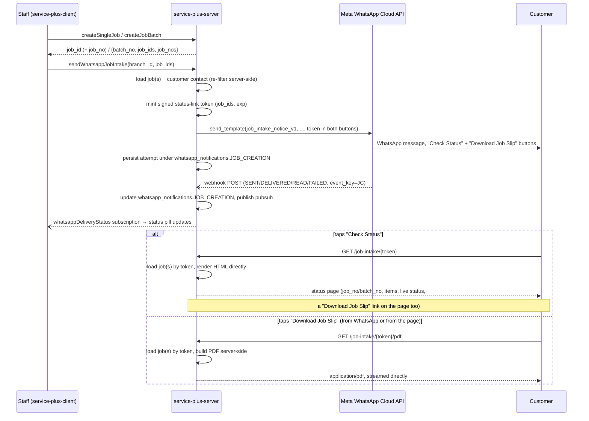

# WhatsApp Job Intake Notice — design (not implemented yet)

## Goal

When a customer drops off a device (or a batch of devices) for repair, replace the printed
job slip with a WhatsApp notification, a public status page, and an on-demand PDF — all
served directly by `service-plus-server`, no separate frontend app in the loop:

```
WhatsApp: "1 item received — Job No JOB-1024"  (or "12 items received — Batch No 88")
    ↓ (tap "Check Status")              ↓ (tap "Download Job Slip")
Public status page (server-rendered)    PDF (server-built), streamed directly
    ↓ (tap "Download Job Slip" on the page too)
same PDF
```

- **WhatsApp** — short, searchable acknowledgement. Primary notification.
- **Status page** — interactive record. Shows every item and its current status, keeps
  working after delivery so the customer can pull it up any time later. Plain
  server-rendered HTML — no React app, no build step, no separate deploy.
- **PDF** — formal downloadable/printable copy, built server-side on request. Mainly for
  corporate customers and multi-item drop-offs. Reachable two ways: its own WhatsApp
  button, or a link on the status page.

Applies uniformly to a single job and a batch — the batch case is not a special path,
see the "grouping is already batch-safe" note in Step 5.

**Deliberately not `service-plus-web`:** the marketing/spare-parts site's existing
"Track your repair" widget was the obvious precedent to copy, but this feature must not
live there — see "What already exists" below for why, and Step 4 for where it lives
instead.

## Naming

This app already has a "Receipt" — the Money Receipt issued on payment (`MR` prefix).
The new feature is issued at drop-off, before any payment, and must not share
vocabulary with that document anywhere — in code, in the UI, or in customer-facing
text. No "receipt", no `receipt_no`, no `/receipt/...` route. The identifiers this
feature surfaces are the ones the app already has:

- **Single job** → `job_no` (e.g. `JOB-1024`).
- **Batch** → `batch_no` (e.g. `88`), plus each item's own `job_no`.

| Old draft's term | Replaced by |
|---|---|
| "Intake Receipt" | **Job Intake Notice** (the WhatsApp message) |
| "receipt number" | `job_no` (single) / `batch_no` (batch) — no unified synthetic id |
| "Receipt link" / receipt token | **status link** / intake token |
| "Web receipt page" | **job-intake status page** |
| "PDF receipt" | **job-intake PDF** / **job slip PDF** |
| `job.whatsapp_notifications` key `JOB_CREATION` | unchanged — already receipt-free |

No new numbering series either way: `job_no` and `batch_no` are claimed atomically
today by job/batch creation (Step 6 shows exactly where) — this feature only reads
them, never claims a third id.

## Workflow



## What already exists (verified against the actual code, not assumed)

A working send/track path already exists for exactly one event, `JOB_COMPLETION` —
this feature adds a second event (`JOB_CREATION`) onto the same rail, not a parallel
one:

```
server  app/whatsapp/{client.py, sender.py, templates.py, mobile.py}   send_template(), TEMPLATES dict
        app/routers/webhooks/whatsapp_webhook_router.py                GET verify + POST status callback
        app/db/sql/sql_jobs.py  SET_JOB_WHATSAPP_ATTEMPT / _OUTCOME     job.whatsapp_notifications->'JOB_COMPLETION'
        app/graphql/resolvers/subscription.py                          whatsappDeliveryStatus pubsub → GraphQL subscription
client  jobs/customer-connect/*                                        grid + live subscription, no polling
        jobs/send-whatsapp-completion.ts                                sendWhatsappCompletion mutation wrapper
```

**Why not service-plus-web, despite the obvious precedent.** `app/routers/public/
website_router.py` already serves `service-plus-web`'s "Track your repair" widget
(job-status-by-job-no, open-jobs-by-mobile) — the nearest existing example of "customer
looks at their job with no login." That was this feature's first-draft model. It was
ruled out on purpose: routing a transactional, per-send WhatsApp link through the
marketing/spare-parts site would couple this feature's uptime and URL space to a
site that's explicitly static-export, shared-cPanel-hosted (see `plans/plan-parts-web.md`
§2), and scoped to browsing/marketing content — not to per-token transactional pages.
Keeping `job-intake` routes on `service-plus-server` itself (already a public HTTPS
host today, serving `website_router.py`'s own JSON routes to the internet) avoids that
coupling entirely, at the cost of being the **first HTML-rendering, non-JSON route**
in this server. The nearest existing precedent for hand-built HTML in this codebase is
`_build_contact_email_html` (`website_router.py:646-660` — inline-styled, `html.escape`d
f-string HTML), used for an email body today; Step 4 follows the same construction
style for a served page instead.

`plans/plan1.md` (Paperless Job Delivery, **designed but not yet built** — no
`app/whatsapp/token.py` exists yet as of this writing) independently arrived at a
signed token module and a token-gated public route with no `X-Website-Key`, plus reuse
of the existing `whatsappDeliveryStatus` pubsub channel for a new status value. Steps 2
and 4 below build those pieces generically so plan1 can reuse them rather than
duplicate them — **whichever of the two features lands first should build them once**;
if plan1 ships first, skip re-creating `token.py` in Step 2 and extend it instead. (Note:
`plan1.md` currently assumes its own confirmation page lives on `service-plus-web`,
mirroring the same precedent this document just ruled out for itself — worth revisiting
there too, but that's `plan1.md`'s call to make, not this document's.)

`job.whatsapp_notifications` previously had four keys — `JOB_CREATION`/`COMPLETION`/
`DELIVERY`/`RECEIPT` — with a PDF-document-attachment send flow that was deliberately
deleted (see the in-app dev docs, "What was removed"). This design revives the
`JOB_CREATION` key but **stays text+link only in the WhatsApp message itself**, on
purpose — no document/media template, matching what `app/whatsapp/client.py`'s current
docstring says was intentionally stripped out. The "Download Job Slip" button is a
plain URL button (Step 4/5), not a document header — Meta never hosts or sees the PDF
bytes; it's just a link back to this server, same mechanism as "Check Status."

## Implementation steps

Each step below names its exact target files and can be built and unit-tested on its
own; the **Dependencies** line says what it needs merged first. Steps 3 and 8 have no
code dependency on anything else and can start immediately in parallel.

### Step 1 — Make the WhatsApp attempt/outcome SQL event-keyed

**Problem.** `SET_JOB_WHATSAPP_ATTEMPT` and `SET_JOB_WHATSAPP_OUTCOME`
(`app/db/sql/sql_jobs.py:1926` and `:1988`) hardcode the literal path segment
`'JOB_COMPLETION'` in every `jsonb_set`/`->` step. `_build_biz_opaque_callback_data`
(`app/whatsapp/sender.py:77-81`) and the webhook's `_decode_callback_data`
(`app/routers/webhooks/whatsapp_webhook_router.py:99-108`) only carry
`db_name|schema|job_id,job_id,…` — no event discriminator. Today that's fine because
only one event exists; adding `JOB_CREATION` means a delivery-status callback for a
job-intake send would silently overwrite the job's `JOB_COMPLETION` state instead.

**Target files:**
- `app/db/sql/sql_jobs.py:1926-1986` (`SET_JOB_WHATSAPP_ATTEMPT`) and `:1988-2035`
  (`SET_JOB_WHATSAPP_OUTCOME`) — parameterize the `'JOB_COMPLETION'` literal on a new
  `%(event_key)s` arg at every occurrence (both are already deep `jsonb_set` chains
  per the comment at `sql_jobs.py:1913-1922` about single-chain no-ops — this is a
  find/replace of the literal, not a rewrite of the chain shape).
- `app/whatsapp/sender.py:77-81` (`_build_biz_opaque_callback_data`) and `:110-129`
  (`_persist_attempt`) — add an `event_key` parameter; new callback format
  `db_name|schema|event_key|job_id,job_id,…` (`JC` for `JOB_CREATION`, `CC` for
  `JOB_COMPLETION`).
- `app/routers/webhooks/whatsapp_webhook_router.py:99-108` (`_decode_callback_data`)
  and `:120-172` (`_apply_status_callback`) — parse the new 4-part format and pass
  `event_key` through to `SET_JOB_WHATSAPP_OUTCOME`. **Must stay backward compatible**:
  any message already in flight when this ships was sent with the old 3-part format —
  decode both, treating a 3-part payload as `event_key="CC"`.

**Dependencies:** none. This only changes plumbing; existing `JOB_COMPLETION` sends
keep working, now explicitly tagged instead of implicitly assumed.

### Step 2 — Signed status-link token module

**Target file:** `app/whatsapp/token.py` (new).

```python
def sign(db_name: str, schema: str, job_ids: list[int], ttl_days: int = 730) -> str: ...
def verify(token: str) -> tuple[str, str, list[int]] | None: ...
```

Plain HMAC-SHA256 over a pipe-delimited payload plus an expiry timestamp — same shape
discipline as `biz_opaque_callback_data`: no JSON, no table, no DB round-trip to
validate. `ttl_days=730` (~2 years): this is a digital stand-in for a paper slip a
customer may need a year later, not a login session — a short TTL would defeat that,
and the data behind it is no more sensitive than what's already printed on the paper
job sheet.

Sign with a **dedicated** secret, not `whatsapp_app_secret` (`app/core/settings/
whatsapp_settings.py:31-33`, which authenticates *Meta's* webhook calls, a different
trust boundary) and not `settings.secret_key` (`app/core/security.py`, which
authenticates *logged-in staff*). Add `whatsapp_link_token_secret: str = Field(default="",
repr=False, ...)` to `WhatsappSettings` in `app/core/settings/whatsapp_settings.py`,
next to the existing `whatsapp_app_secret`/`whatsapp_webhook_verify_token` fields.

The same token identifies a single job (one-element `job_ids`) or a batch (every
`job_id` in that batch) — no separate "kind" field needed; Step 4's routes derive
`job_no` vs `batch_no` from what they find when they load those rows.

**Dependencies:** none. Check first whether `plans/plan1.md` already shipped this file
— if so, reuse it as-is; its signature already covers this feature's needs.

### Step 3 — Meta template

Draft and submit `job_intake_notice_v1`; add it to `TEMPLATES` in
`app/whatsapp/templates.py:22` (a new dict entry keyed `"JOB_CREATION"`, alongside the
existing `"JOB_COMPLETION"` entry). Wording is in the "Meta template" section below.

**Dependencies:** none — can be submitted for Meta review before any other step lands,
since approval turnaround is the slowest part of this whole feature.

### Step 4 — Public status page + job-slip PDF, served directly by service-plus-server

**Target file:** `app/routers/public/job_intake_router.py` (new).

Unlike `app/routers/public/website_router.py` (whose `router = APIRouter(...,
dependencies=[Depends(require_website_key)])` at line 42-46 gates *every* route behind
the `X-Website-Key` header, and whose routes all return JSON via Pydantic
`response_model`s), this router's only credential is the token itself, and it returns
**HTML and PDF bytes directly** — no `X-Website-Key`, no separate frontend consuming a
JSON response. It needs its own `APIRouter` instance, mounted with **no `/api` prefix**
(prefix `/job-intake`) so the printed/messaged URL reads as a page, not an API call:

```
GET /job-intake/{token}       → HTML status page
GET /job-intake/{token}/pdf   → application/pdf, built on request
```

**Shared loading logic** (one internal function both routes call):
- Decode via Step 2's `token.py`; on failure, render a plain "this link is invalid or
  expired, contact the shop" page (or PDF error response) — not a 500, not a
  partial-data leak.
- Load the jobs by `job_ids`, resolve `db_name`/`schema` from the token itself (no
  `public_directory.resolve_company` lookup needed — the token already carries tenant
  identity, unlike `website_router.py`'s company-code flow).
- New whitelisted query in `app/db/sql/sql_public.py` (`PublicSql` class, same
  discipline as its existing queries — no `SELECT *`, no internal ids, no amounts):
  select `job_no`, `batch_no`, `device` (product/brand/model, same
  `TRIM(CONCAT_WS(...))` pattern as `GET_JOBS_FOR_WHATSAPP_COMPLETION`,
  `app/db/sql/sql_jobs.py:1887`), `status`, `branch_name`, `customer_name`. Not
  filtered by job status — must keep working after delivery.
- Internal shape (a plain dataclass/dict, not exposed as an API contract since nothing
  external consumes it as JSON):
  `{batch_no: int | None, job_no: str | None, branch_name, customer_name, items:
  [{job_no, device, status}, ...]}` — `batch_no` present only when the token covers
  more than one job, `job_no` present only when there's exactly one item.

**`GET /job-intake/{token}` (HTML):**
- Build the page as an inline-styled f-string, `html.escape`d, same construction style
  as `_build_contact_email_html` (`website_router.py:646-660`) — no template engine
  needed for one small page, matching this codebase's existing practice (Jinja2 isn't
  used anywhere today, confirmed).
- Render `job_no` or `batch_no`, branch/customer line, one row per item with its
  status, and a "Download Job Slip" link pointing at the sibling `/pdf` route (same
  token) — so the PDF is reachable from the page even for a customer who arrived via
  "Check Status" rather than the PDF button.
- Return via Starlette's `HTMLResponse`.

**`GET /job-intake/{token}/pdf` (PDF):**
- Build the PDF **server-side in Python** — add `reportlab` to `requirements.txt`
  (confirmed no PDF library present in this repo today; pure-Python, no native
  dependencies, a good fit for a small structured document — job_no/batch_no header
  plus an item table, the same shape `job-sheet-pdf.ts`'s `getJobSheetBlobUrl`/
  `getBatchJobSheetBlobUrl` (`service-plus-client`, lines 266/478) produce with jsPDF,
  reimplemented fresh here rather than shared — different language, different app,
  and this version is fed only by the whitelisted public fields above, never the
  internal `JobDetailType` those functions take).
- Return via `fastapi.Response(content=pdf_bytes, media_type="application/pdf",
  headers={"Content-Disposition": 'attachment; filename="job-slip-{ref}.pdf"'})`.

**New app-setting: `job_intake_url`, not a reuse of `track_job_url`.** `track_job_url`
(seeded in `app/db/seeds/seed_bu_data.py:230`, id 12) already points at
`service-plus-web`'s domain and is what today's printed job sheets use for the existing
Track-your-repair feature — repointing it would silently break that feature. Add a
**new** per-BU app-setting, `job_intake_url`, seeded alongside it, holding
`service-plus-server`'s own public base URL (the same host `website_router.py`'s
`/api/public/...` routes are already reachable on today) — this is what Step 5's
buttons are built from, kept entirely separate from `track_job_url`.

- Rate-limit both routes the same way the webhook router does:
  `Depends(rate_limit("job-intake", limit=60, window_seconds=60))` and
  `Depends(rate_limit("job-intake-pdf", limit=30, window_seconds=60))`.
- Register in `app/main.py`: add `from app.routers.public.job_intake_router import
  router as job_intake_router` near line 19, and `app.include_router(job_intake_router)`
  near line 81-82.

**Dependencies:** Step 2 (token decode). Step 1 is not required (these routes only
read jobs, never write `whatsapp_notifications`).

### Step 5 — Server send path

**Target files:**
- `app/whatsapp/sender.py` — new `send_job_creation_notice(db_name, schema, branch_id,
  job_ids)`, mirroring `resolve_send_whatsapp_completion_helper` (lines 169-243) and
  `_send_chunk` almost line for line: re-filter server-side (never trust the client's
  `job_ids`), group by `customer_contact_id`, chunk at the existing
  `MAX_JOBS_PER_WHATSAPP_MESSAGE = 35` cap (line 27). **This grouping/chunking is
  already batch-safe as written** — a batch of, say, 12 jobs for one customer becomes
  one message with `item_summary = "12 items"`; nothing batch-specific needs adding
  here, which is the same "single job is a batch of one" property the original design
  wanted.
- New SQL, `GET_JOBS_FOR_WHATSAPP_CREATION` in `app/db/sql/sql_jobs.py`, modeled on
  `GET_JOBS_FOR_WHATSAPP_COMPLETION` (line 1876-1899) but **without** the `j.is_final =
  true AND js.code = 'COMPLETED_OK'` filter (line 1897-1898) — an intake notice fires
  right after creation, before the job is anywhere near final. Also select `j.batch_no`.
- Mint the status-link token via Step 2's `token.py` inside `send_job_creation_notice`,
  build **both** buttons' dynamic URL suffixes from it: `Check Status` →
  `{job_intake_url}/job-intake/{token}`, `Download Job Slip` →
  `{job_intake_url}/job-intake/{token}/pdf` — base URL the new `job_intake_url`
  app-setting from Step 4 (`https://` prepended), **not** `track_job_url`.
- Persist the attempt via Step 1's now-parameterized `SET_JOB_WHATSAPP_ATTEMPT` with
  `event_key="JOB_CREATION"`.
- New GraphQL mutation `sendWhatsappJobIntake(db_name, schema, value)`, wired in
  `app/graphql/resolvers/mutation.py` the same way `sendWhatsappCompletion` is (lines
  420-430) — same `branch_id`/`job_ids` payload shape as the existing mutation.
- **Access right**: none new — `JOBS_CUSTOMER_CONNECT` already gates the client-side
  entry points this hooks into; `sendWhatsappCompletion` itself carries no server-side
  `require_access_right` guard, and this mutation follows the same precedent.

**Dependencies:** Step 1 (event-keyed persistence), Step 2 (token), Step 3 (the
`TEMPLATES["JOB_CREATION"]` entry must exist, though it can be a placeholder/unapproved
template while coding this), Step 4 (both button URLs must resolve to real routes).

### Step 6 — Single-job creation returns `job_no`

**Target file:** `app/graphql/resolvers/jobs/mutations.py`.

`resolve_create_single_job_helper` (lines 77-171) already claims `job_no` via
`SqlStore.CLAIM_NEXT_JOB_NUMBER` (line 119) but returns only `job_id` (line 171) — the
client currently has to re-fetch job detail to learn its own job number. Add `job_no`
to the returned dict, same as `resolve_create_job_batch_helper` (lines 574-658)
already returns `{"batch_no", "job_ids", "job_nos"}` (line 658). Update the GraphQL
schema type for `createSingleJob`'s return and `graphql-map.ts:152-155` accordingly.

**Dependencies:** none — purely additive to an existing return payload.

### Step 7 — Client: WhatsApp-on-creation hook and buttons

**Target files:**
- `src/constants/graphql-map.ts` — new `sendWhatsappJobIntake` entry, same shape as
  the existing `sendWhatsappCompletion` entry (lines 202-205).
- New shared hook (in-flight state, mobile validation, toast), modeled on
  `send-whatsapp-completion.ts` (36 lines, whole file is the pattern to copy) and its
  one real caller's usage in `customer-connect-section.tsx` (lines 59-76, 340-368:
  `useState` for `sending`/`results`, `toast` from `sonner`, mobile pre-validated via
  `isValidMobile` from `src/lib/mobile.ts:21`).
- Wire a "WhatsApp" button at each creation call site:
  - `single-job-section.tsx` — after the `createSingleJob` mutation resolves (line
    227-230, right where `toast.success(MESSAGES.SUCCESS_JOB_CREATED)` fires) — now
    has `job_no` from Step 6 to show alongside it.
  - `batch-job-section.tsx` — after `createJobBatch` resolves (lines 253-262), where
    `batch_no`/`job_ids`/`job_nos` are already destructured from the result.
  - `job-details-modal.tsx` — same detail-view call site that already builds PDFs via
    `openPdf` (lines 236, 263, 270, 299), for re-sending after the fact.

**Dependencies:** Step 5 (the mutation must exist).

### Step 8 — Client: status indicator

**Target file:** `customer-connect-grid.tsx:36-75` (`WhatsappStatusCell`).

Currently hardcoded to `getCompletionState(row)` (`customer-connect-helpers.ts:10-12`),
which reads `row.whatsapp_notifications?.JOB_COMPLETION`. Generalize to accept an
`eventKey: "JOB_COMPLETION" | "JOB_CREATION"` prop instead of hardcoding the key, so
the same pill component (success/fail counts, "Last try" timestamp,
`DELIVERY_BADGE_STYLES` badge) renders job-intake status wherever it's needed — the
three call sites from Step 7 and the Customer Connect grid itself.

**Dependencies:** none technically, but only worth doing once Step 7 exists to consume
it.

## Meta template — draft, for review before submission

Mirrors the shape of the already-approved `job_completed_ready_for_pickup_v2`
(`app/whatsapp/templates.py:23-35`) as closely as possible — same header style, same
named-parameter discipline, same closing line — since that shape is proven to pass
Meta review, rather than inventing a new one from scratch.

**`job_intake_notice_v1`** — Utility, `en`, text header.

```
Header: Service Update from {{business_unit}}

Body:
Hi {{customer_name}},

We’ve received your {{item_summary}} for service.

{{reference_line}}
Branch: {{branch_name}}
Contact: {{branch_contact}}

You can check your service status anytime using the button below.

Thank you for choosing {{business_unit}}.

Footer: This is an automated message.
Button 1: URL (dynamic), "Check Status" — base host the new job_intake_url app-setting
          (Step 4, service-plus-server's own public host — not track_job_url, not
          service-plus-web), dynamic suffix the signed token from Step 2:
          `{job_intake_url}/job-intake/{{1}}`.
Button 2: URL (dynamic), "Download Job Slip" — same base host, same dynamic token,
          fixed `/pdf` suffix baked into the button's registered URL:
          `{job_intake_url}/job-intake/{{1}}/pdf`.
```

**Two buttons, one token, no new parameter.** Both buttons carry the *same* signed
token (`{{1}}`) — a WhatsApp URL button's dynamic part is one placeholder substituted
into a URL string that's otherwise fixed at template-approval time, and that fixed
string can have static text on either side of `{{1}}`, not just before it. So Button
2's trailing `/pdf` doesn't need its own template variable; it's baked into that
button's URL template exactly like any other literal path segment. Button 2 hits
Step 4's PDF route **directly** — tapping it downloads/opens the PDF immediately, no
intermediate status page, no query flag, no client-side build step.

**Watch-out — CTA button cap.** Meta's documented limit is at most 2 call-to-action
(URL/phone) buttons per template, so two URL buttons is at the cap, not under it —
there's no room left for a third CTA (e.g. a "Call Branch" phone button) on this
template without dropping one of these two. Confirm this cap is still current against
Meta's docs at submission time, same discipline as the length-limit checks above.

Named params, in order: `business_unit` (header), `customer_name`, `item_summary`,
`reference_line`, `branch_name`, `branch_contact`, `business_unit` (body closing line
— same param reused untruncated, matching `_build_params`'s existing pattern at
`app/whatsapp/sender.py:84-107` for the `_v2` completion template).

- `item_summary` — `"1 item"` or `"{n} items"`, a new `_format_item_summary(count)`
  helper alongside `_format_job_no`/`_format_device` (`sender.py:52-60`).
- `reference_line` — computed server-side, not a template conditional (Meta templates
  can't branch): `"Job No: JOB-1024"` for a single job. For a batch: `"Batch No: 88 —
  {job_nos}"`, where `{job_nos}` is built by **reusing `_format_job_no()` as-is**
  (`sender.py:52-56` — already joins the first 3 job numbers then elides the rest as
  "…and N more", exactly the truncation this needs). This is the one place
  `job_no`/`batch_no` reach the customer, exactly the identifiers this app already
  issues — never a synthetic id.

  > **Footnote — why one merged string, not separate `job_no`/`batch_no` params:**
  > a template's approved structure is fixed — Meta gives no `if`/`else` inside body
  > text, so there's no way to say "show `job_no` for a single job, `batch_no` for a
  > batch" with two named parameters and template-side logic. The only lever the
  > sender has per send is *which string* it fills a parameter with, so the
  > single-vs-batch branch has to happen in `_build_params`-equivalent Python code
  > (Step 5), producing one already-labeled string (`"Job No: …"` / `"Batch No: …"`)
  > that `reference_line` just drops in verbatim. This is the same reason
  > `_format_amount` renders the literal `"No charge"` into a value instead of the
  > template branching on amount == 0 (`sender.py`'s existing pattern) — anywhere this
  > design needs conditional wording, it's resolved server-side into a value, never
  > left to the template.

**Why job numbers only, not per-item device details, and why truncated at 3:** two
real constraints, not a style preference.

1. **No newlines in parameter values.** `_sanitize()` (`sender.py:29-33`) strips
   `\n`/`\t` from every body param because — per its own comment — Meta rejects the
   send outright if a parameter value contains one. A per-item list
   (`JOB-1024 — iPhone 13, screen`, one job per line) can't be a WhatsApp parameter at
   all; it would have to be flattened onto a single line, which stops being readable
   past a handful of items.
2. **1024-character body budget, shared with everything else in the message.** Meta
   caps template body text at 1024 characters total. `MAX_JOBS_PER_WHATSAPP_MESSAGE =
   35` (`sender.py:27`) already caps one message to 35 jobs — bare job numbers for all
   35 could plausibly fit, but job number *plus* a device description per item would
   blow the budget well before 35 and, worse, be an unreadable wall of text on a phone
   screen even if it technically fit.

So the message always shows at most 3 job numbers plus a count of the rest, never
device details — full per-item detail (`job_no`, `device`, `status`, for every item,
no length limit) is exactly what the status page (Step 4) is for. That division of
labor — short pointer in WhatsApp, full detail on the page it links to — is the actual
reason this design routes through a link instead of trying to cram everything into the
message.

Verify before locking wording, against Meta's current docs: per-message length limits
on a dynamic URL suffix, and whether the button's base host needs pre-approval — same
15-minute discipline `plan1.md` recommends for its own template, and the same `en` vs
`en_US` trap the completion template's rollout already hit once.

## Out of scope for this phase

SMS/email, a second BSP, an outbox/retry queue, per-message audit history beyond the
latest-state jsonb, attaching the PDF to the WhatsApp message itself as a document
header (Meta document/media template support was deliberately removed from this
codebase once already — see "What already exists" above — reintroducing it is a
separate, larger decision, not a variant of this feature; the "Download Job Slip"
button stays a plain link back to this server, never a Meta-hosted attachment), and
job-delivery WhatsApp triggers (that's `plans/plan1.md`'s scope).

## Verification

- A single job's status link shows its own `job_no`; a batch's shows its `batch_no`
  plus every item's `job_no`.
- The WhatsApp message's "Check Status" button opens the status page directly, no
  login, showing every item covered by that token — served by `service-plus-server`
  itself, not `service-plus-web`.
- The WhatsApp message's "Download Job Slip" button downloads/opens the PDF directly,
  without landing on the status page first.
- The status page and the PDF still work after every item is delivered.
- The PDF's content matches what the status page shows — no internal-only fields in
  either (same whitelisted-field discipline as `website_router.py`'s public routes).
- A tampered or expired token is rejected cleanly on both routes, not a 500, not a
  partial-data leak.
- `whatsapp_notifications.JOB_CREATION` updates on send and resend without touching
  `JOB_COMPLETION` on the same row (Step 1's event-key parameterization is what this
  actually tests).
- A `JOB_CREATION` webhook callback (`event_key=JC`) routes to the right jsonb key;
  a legacy 3-part `JOB_COMPLETION` callback still decodes correctly (backward-compat
  case from Step 1).
- Sending for a 12-job batch produces one WhatsApp message (not twelve), per Step 5's
  existing grouping/chunking behavior.
- `job_intake_url` and `track_job_url` resolve to different hosts, and sending a
  job-intake notice never touches `track_job_url`.
